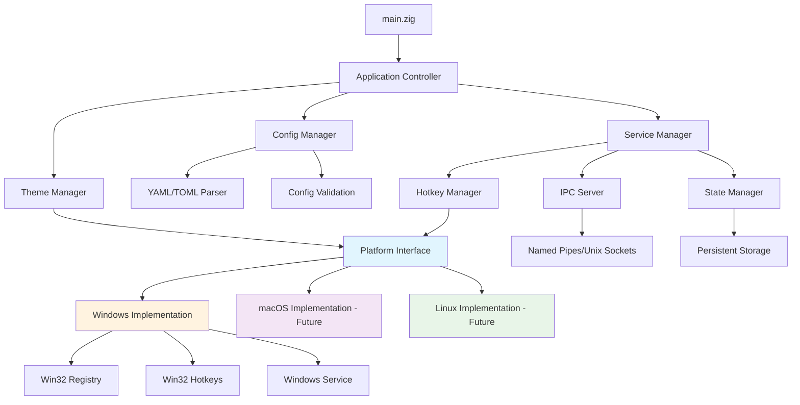

# Zig MVP Project Structure Guide
## Windows 11 x86 Dark/Light Mode Switching Application

### Document Purpose
This comprehensive guide provides a detailed architectural blueprint and implementation roadmap for building a Windows theme switching application in Zig, designed with cross-platform expansion in mind and optimized for AI-assisted collaborative development.

---

## Table of Contents
1. [Project Overview](#1-project-overview)
2. [Directory Structure](#2-directory-structure)
3. [Core Architecture Design](#3-core-architecture-design)
4. [Module Breakdown](#4-module-breakdown)
5. [Build Configuration](#5-build-configuration)
6. [Configuration System](#6-configuration-system)
7. [AI Collaboration Guidelines](#7-ai-collaboration-guidelines)
8. [Implementation Roadmap](#8-implementation-roadmap)
9. [Code Examples and Patterns](#9-code-examples-and-patterns)

---

## 1. Project Overview

### Vision Statement
Create a Windows 11 x86 dark/light mode switching application in Zig that serves as both a functional tool and a comprehensive learning experience in systems programming, designed from the ground up for cross-platform expansion.

### Core Principles
- **Learning-First Design**: Every architectural decision optimizes for educational value
- **AI-Assisted Development**: Structure code and documentation for effective AI collaboration  
- **Cross-Platform Foundation**: 65-70% code sharing potential across Windows/macOS/Linux
- **Architectural Elegance**: Clean abstractions and explicit error handling patterns
- **Incremental Complexity**: MVP → Full Features → Cross-Platform expansion

### MVP Requirements Summary
```zig
// Core MVP functionality
const MVPRequirements = struct {
    registry_manipulation: bool = true,        // HKEY_CURRENT_USER theme settings
    global_hotkey: bool = true,               // Win32 RegisterHotKey() integration
    background_service: bool = true,          // Hidden window architecture
    configuration_management: bool = true,    // YAML/TOML file handling
    single_instance: bool = true,            // Process enforcement
    auto_start: bool = true,                 // Windows Registry Run key
    error_handling: bool = true,             // Comprehensive error patterns
    logging: bool = true,                    // Development and debugging support
};
```

---

## 2. Directory Structure

### Complete Project Organization
```
dark-watcher/                           # Root project directory
├── README.md                          # Project overview and quick start
├── LICENSE                            # TBD
├── build.zig                          # Main build configuration
├── build.zig.zon                      # Package dependencies
├── .gitignore                         # Git exclusions
│
├── src/                               # Source code root
│   ├── main.zig                       # Application entry point
│   │
│   ├── core/                          # Core business logic (cross-platform)
│   │   ├── theme_manager.zig          # Central theme switching orchestration
│   │   ├── config_manager.zig         # Configuration loading and validation
│   │   ├── hotkey_manager.zig         # Hotkey registration abstraction
│   │   ├── service_manager.zig        # Background service lifecycle
│   │   ├── ipc_server.zig            # Inter-process communication
│   │   ├── state_manager.zig         # Application state persistence
│   │   └── error_types.zig           # Centralized error definitions
│   │
│   ├── platform/                      # Platform-specific implementations
│   │   ├── interface.zig             # Platform abstraction interfaces
│   │   ├── windows/                  # Windows-specific code
│   │   │   ├── registry.zig          # Windows registry operations
│   │   │   ├── hotkeys.zig           # Win32 hotkey implementation
│   │   │   ├── service.zig           # Windows service integration
│   │   │   ├── autostart.zig         # Registry Run key management
│   │   │   ├── win32_bindings.zig    # Win32 API declarations
│   │   │   └── utils.zig             # Windows-specific utilities
│   │   ├── macos/                    # macOS implementation (future)
│   │   │   ├── defaults.zig          # macOS defaults system integration
│   │   │   ├── hotkeys.zig           # Carbon/Cocoa hotkey handling
│   │   │   └── utils.zig             # macOS-specific utilities
│   │   └── linux/                    # Linux implementation (future)
│   │       ├── desktop_env.zig       # DE detection (GNOME/KDE/XFCE)
│   │       ├── theme_switch.zig      # gsettings/kwriteconfig integration
│   │       ├── hotkeys.zig           # X11/Wayland hotkey handling
│   │       └── utils.zig             # Linux-specific utilities
│   │
│   ├── utils/                        # Shared utilities and helpers
│   │   ├── logging.zig              # Logging system implementation
│   │   ├── memory.zig               # Memory management helpers
│   │   ├── string_utils.zig         # String manipulation utilities
│   │   ├── file_utils.zig           # File I/O helpers
│   │   └── time_utils.zig           # Time and scheduling utilities
│   │
│   └── tests/                        # Test organization
│       ├── unit/                     # Unit tests by module
│       ├── integration/              # Integration test scenarios
│       └── test_utils.zig           # Shared testing utilities
│
├── config/                           # Configuration and data files
│   ├── default.yaml                  # Default configuration template
│   ├── schema.yaml                   # Configuration schema validation
│   └── examples/                     # Example configurations
│       ├── minimal.yaml             # Minimal setup
│       ├── advanced.yaml            # Advanced configuration
│       └── development.yaml         # Development settings
│
├── docs/                            # Documentation and guides
│   ├── architecture.md             # Detailed architecture documentation
│   ├── api_reference.md            # API and module documentation
│   ├── development_guide.md        # Development setup and workflow
│   ├── ai_collaboration.md         # AI assistant usage patterns
│   ├── cross_platform.md          # Cross-platform development notes
│   └── troubleshooting.md          # Common issues and solutions
│
├── build/                          # Build output and artifacts
│   ├── windows-x86_64/            # Windows build output
│   ├── macos-aarch64/             # macOS build output (future)
│   └── linux-x86_64/             # Linux build output (future)
│
├── tools/                         # Development and build tools
│   ├── install.zig               # Installation script
│   ├── uninstall.zig            # Uninstallation script
│   ├── config_validator.zig     # Configuration validation tool
│   └── debug_client.zig         # Debug IPC client
│
└── ci/                           # Continuous integration
    ├── build_all_platforms.zig  # Cross-platform build script
    ├── run_tests.zig           # Test execution script
    └── package.zig             # Release packaging
```

### Directory Design Principles

#### Separation of Concerns
- **`src/core/`**: Business logic independent of platform details
- **`src/platform/`**: Platform-specific implementations behind common interfaces
- **`src/utils/`**: Reusable utilities that work across platforms

#### Cross-Platform Readiness
- **Interface-Driven Design**: Common interfaces in [`src/platform/interface.zig`](src/platform/interface.zig)
- **Conditional Compilation**: Platform selection via Zig's [`comptime`](src/platform/interface.zig) features
- **Shared Utilities**: Maximum code reuse in [`src/utils/`](src/utils/) and [`src/core/`](src/core/)

#### AI Collaboration Optimization
- **Clear Module Boundaries**: Each file has single, well-defined responsibility
- **Documentation Co-location**: Architecture docs alongside implementation
- **Example-Driven**: Configuration examples and usage patterns readily available

---

## 3. Core Architecture Design

### Platform Abstraction Architecture

```zig
// src/platform/interface.zig - Core abstraction layer
const std = @import("std");

// Platform-agnostic theme representation
pub const Theme = enum {
    light,
    dark,
    auto, // System preference following
};

// Error types that can occur across platforms
pub const ThemeError = error{
    PermissionDenied,
    SystemNotSupported,
    ConfigurationError,
    PlatformSpecificError,
};

// Core platform interface - implemented by each platform
pub const PlatformInterface = struct {
    // Function pointers to platform-specific implementations
    set_theme: *const fn (theme: Theme) ThemeError!void,
    get_current_theme: *const fn () ThemeError!Theme,
    register_hotkey: *const fn (hotkey: HotkeyConfig, callback: HotkeyCallback) ThemeError!HotkeyHandle,
    unregister_hotkey: *const fn (handle: HotkeyHandle) ThemeError!void,
    start_service: *const fn (config: ServiceConfig) ThemeError!void,
    stop_service: *const fn () ThemeError!void,
    
    // Platform-specific cleanup
    deinit: *const fn () void,
};

// Compile-time platform selection
pub fn createPlatformInterface(allocator: std.mem.Allocator) ThemeError!PlatformInterface {
    return switch (std.builtin.target.os.tag) {
        .windows => @import("windows/interface.zig").create(allocator),
        .macos => @import("macos/interface.zig").create(allocator),
        .linux => @import("linux/interface.zig").create(allocator),
        else => ThemeError.SystemNotSupported,
    };
}
```

### Component Interaction Architecture



### Error Handling Strategy

```zig
// src/core/error_types.zig - Centralized error management
const std = @import("std");

// Hierarchical error types for clear error propagation
pub const AppError = error{
    // Configuration errors
    ConfigNotFound,
    ConfigInvalid,
    ConfigPermissionDenied,
    
    // Platform errors  
    PlatformNotSupported,
    PlatformFeatureMissing,
    
    // Service errors
    ServiceAlreadyRunning,
    ServiceNotRunning,
    ServicePermissionDenied,
    
    // Theme switching errors
    ThemeNotSupported,
    ThemeSetFailed,
    ThemeGetFailed,
    
    // Hotkey errors
    HotkeyConflict,
    HotkeyRegistrationFailed,
    
    // IPC errors
    IPCConnectionFailed,
    IPCMessageInvalid,
    
    // System errors
    OutOfMemory,
    FileSystemError,
    NetworkError,
} || std.mem.Allocator.Error || std.fs.File.OpenError;

// Error context for debugging and logging
pub const ErrorContext = struct {
    error_code: AppError,
    message: []const u8,
    file: []const u8,
    line: u32,
    platform_specific: ?[]const u8 = null,
    
    pub fn create(err: AppError, msg: []const u8, src: std.builtin.SourceLocation) ErrorContext {
        return ErrorContext{
            .error_code = err,
            .message = msg,
            .file = src.file,
            .line = src.line,
        };
    }
};
```

### Memory Management Strategy

```zig
// src/utils/memory.zig - Consistent memory management patterns
const std = @import("std");

// Application-wide allocator strategy
pub const AppAllocator = struct {
    gpa: std.heap.GeneralPurposeAllocator(.{}),
    allocator: std.mem.Allocator,
    
    pub fn init() AppAllocator {
        var gpa = std.heap.GeneralPurposeAllocator(.{}){};
        return AppAllocator{
            .gpa = gpa,
            .allocator = gpa.allocator(),
        };
    }
    
    pub fn deinit(self: *AppAllocator) void {
        _ = self.gpa.deinit();
    }
};

// RAII-style resource management
pub fn ResourceManager(comptime T: type) type {
    return struct {
        resource: T,
        cleanup_fn: *const fn (T) void,
        
        const Self = @This();
        
        pub fn init(resource: T, cleanup_fn: *const fn (T) void) Self {
            return Self{
                .resource = resource,
                .cleanup_fn = cleanup_fn,
            };
        }
        
        pub fn deinit(self: Self) void {
            self.cleanup_fn(self.resource);
        }
    };
}
```

---

## 4. Module Breakdown

### Core Module Responsibilities

#### [`src/main.zig`](src/main.zig) - Application Entry Point
**Purpose**: Application bootstrap and lifecycle management
**Key Responsibilities**:
- Command-line argument parsing and validation
- Single instance enforcement via named mutex
- Platform detection and interface initialization  
- Error handling and graceful shutdown
- Logging system setup

```zig
// Main application structure
pub fn main() !void {
    // 1. Initialize memory management
    // 2. Parse command line arguments
    // 3. Load and validate configuration
    // 4. Enforce single instance
    // 5. Initialize platform interface
    // 6. Start service manager
    // 7. Enter main event loop
    // 8. Handle graceful shutdown
}
```

#### [`src/core/theme_manager.zig`](src/core/theme_manager.zig) - Theme Switching Orchestration
**Purpose**: Central coordinator for all theme switching operations
**Key Responsibilities**:
- Theme state management and validation
- Platform-agnostic theme switching logic
- Theme change event propagation
- State persistence and recovery

**Dependencies**: Platform Interface, Config Manager, State Manager
**Interface Design**:
```zig
pub const ThemeManager = struct {
    platform: PlatformInterface,
    config: *const Config,
    state: *StateManager,
    
    pub fn init(allocator: std.mem.Allocator, platform: PlatformInterface, config: *const Config) !ThemeManager;
    pub fn setTheme(self: *ThemeManager, theme: Theme) !void;
    pub fn toggleTheme(self: *ThemeManager) !void;
    pub fn getCurrentTheme(self: *ThemeManager) !Theme;
    pub fn deinit(self: *ThemeManager) void;
};
```

#### [`src/core/config_manager.zig`](src/core/config_manager.zig) - Configuration Management
**Purpose**: Configuration loading, validation, and live updates
**Key Responsibilities**:
- YAML/TOML configuration file parsing
- Configuration schema validation
- Live configuration reloading via file watching
- Default value management and migration

**Dependencies**: File Utils, Logging
**Interface Design**:
```zig
pub const ConfigManager = struct {
    config: Config,
    file_path: []const u8,
    watcher: ?FileWatcher,
    
    pub fn load(allocator: std.mem.Allocator, path: []const u8) !ConfigManager;
    pub fn save(self: *ConfigManager) !void;
    pub fn reload(self: *ConfigManager) !void;
    pub fn startWatching(self: *ConfigManager, callback: ConfigChangeCallback) !void;
    pub fn validate(self: *const ConfigManager) !void;
};
```

#### [`src/core/hotkey_manager.zig`](src/core/hotkey_manager.zig) - Hotkey Abstraction
**Purpose**: Cross-platform hotkey registration and event handling
**Key Responsibilities**:
- Hotkey registration via platform interface
- Hotkey conflict detection and resolution
- Keyboard event processing and callback dispatch
- Dynamic hotkey configuration updates

**Dependencies**: Platform Interface, Config Manager
**Interface Design**:
```zig
pub const HotkeyManager = struct {
    platform: PlatformInterface,
    registered_hotkeys: std.ArrayList(HotkeyRegistration),
    
    pub fn init(allocator: std.mem.Allocator, platform: PlatformInterface) !HotkeyManager;
    pub fn registerHotkey(self: *HotkeyManager, config: HotkeyConfig, callback: HotkeyCallback) !void;
    pub fn unregisterAll(self: *HotkeyManager) !void;
    pub fn processEvents(self: *HotkeyManager) !void;
};
```

#### [`src/core/service_manager.zig`](src/core/service_manager.zig) - Service Lifecycle
**Purpose**: Background service management and coordination
**Key Responsibilities**:
- Service initialization and startup sequence
- Component lifecycle management
- Event loop coordination
- Graceful shutdown handling

**Dependencies**: Theme Manager, Hotkey Manager, IPC Server, State Manager

#### [`src/core/ipc_server.zig`](src/core/ipc_server.zig) - Inter-Process Communication
**Purpose**: External API for theme switching control
**Key Responsibilities**:
- Named pipe server (Windows) / Unix socket server (Linux/macOS)
- Command parsing and validation
- Response formatting and error handling
- Client connection management

**Dependencies**: Theme Manager, Logging

#### [`src/core/state_manager.zig`](src/core/state_manager.zig) - Application State
**Purpose**: Persistent state management and recovery
**Key Responsibilities**:
- Application state serialization/deserialization
- State file management and corruption recovery
- Theme state history and rollback capability
- Configuration state synchronization

**Dependencies**: File Utils, Logging

#### [`src/core/error_types.zig`](src/core/error_types.zig) - Error Definitions
**Purpose**: Centralized error type definitions and error handling patterns
**Key Responsibilities**:
- Comprehensive error taxonomy
- Error context and debugging information
- Error propagation patterns
- Platform-specific error mapping

### Platform Module Structure

#### Windows Implementation ([`src/platform/windows/`](src/platform/windows/))

##### [`registry.zig`](src/platform/windows/registry.zig) - Registry Operations
**Purpose**: Windows registry theme manipulation
**Key Responsibilities**:
- Registry key access and permission handling
- Theme setting read/write operations
- Registry watching for external changes
- Error translation from Win32 to application errors

**Win32 APIs Used**: `RegOpenKeyEx`, `RegSetValueEx`, `RegQueryValueEx`, `RegNotifyChangeKeyValue`

##### [`hotkeys.zig`](src/platform/windows/hotkeys.zig) - Win32 Hotkey Implementation  
**Purpose**: Global hotkey registration using Win32 APIs
**Key Responsibilities**:
- Hotkey registration via `RegisterHotKey`
- Hidden window creation for message handling
- `WM_HOTKEY` message processing
- Virtual key code translation

**Win32 APIs Used**: `RegisterHotKey`, `UnregisterHotKey`, `CreateWindowEx`, `GetMessage`, `DispatchMessage`

##### [`service.zig`](src/platform/windows/service.zig) - Windows Service Integration
**Purpose**: Windows service lifecycle management
**Key Responsibilities**:
- Service registration and installation
- Service control manager integration
- Service status reporting
- Session change notification handling

**Win32 APIs Used**: `CreateService`, `StartService`, `ControlService`, `RegisterServiceCtrlHandler`

##### [`autostart.zig`](src/platform/windows/autostart.zig) - Auto-Start Management
**Purpose**: Windows startup integration
**Key Responsibilities**:
- Registry Run key management
- Startup permission validation
- Auto-start status detection
- User preference handling

**Registry Location**: `HKEY_CURRENT_USER\Software\Microsoft\Windows\CurrentVersion\Run`

##### [`win32_bindings.zig`](src/platform/windows/win32_bindings.zig) - Win32 API Declarations
**Purpose**: Win32 API function and constant declarations
**Key Responsibilities**:
- Win32 function prototypes and calling conventions
- Windows constant definitions
- Structure definitions for Win32 types
- Error code mappings

##### [`utils.zig`](src/platform/windows/utils.zig) - Windows Utilities
**Purpose**: Windows-specific helper functions
**Key Responsibilities**:
- UTF-8 to UTF-16 conversion for Win32 APIs
- Windows version detection and feature availability
- Error message formatting from Win32 error codes
- Resource cleanup helpers

### Utility Module Structure

#### [`src/utils/logging.zig`](src/utils/logging.zig) - Logging System
**Purpose**: Structured logging with multiple output targets
**Key Features**:
- Log levels (Debug, Info, Warn, Error, Fatal)
- Multiple output targets (file, console, system log)
- Structured logging with context
- Log rotation and size management
- Thread-safe logging operations

#### [`src/utils/memory.zig`](src/utils/memory.zig) - Memory Management
**Purpose**: Memory allocation patterns and debugging
**Key Features**:
- RAII-style resource management
- Memory leak detection in debug builds
- Custom allocators for specific use cases
- Memory pool management for frequent allocations

#### [`src/utils/string_utils.zig`](src/utils/string_utils.zig) - String Operations
**Purpose**: String manipulation and encoding utilities
**Key Features**:
- UTF-8/UTF-16 conversion helpers
- String validation and sanitization
- Configuration string parsing
- Path manipulation utilities

#### [`src/utils/file_utils.zig`](src/utils/file_utils.zig) - File I/O Operations
**Purpose**: File system operations and file watching
**Key Features**:
- Safe file reading/writing with proper error handling
- Directory creation and management
- File watching for configuration updates
- Atomic file operations for state persistence

#### [`src/utils/time_utils.zig`](src/utils/time_utils.zig) - Time and Scheduling
**Purpose**: Time-based operations and scheduling
**Key Features**:
- High-resolution timing for performance measurement
- Scheduler for delayed operations
- Time formatting and parsing utilities
- Platform-specific time zone handling

---

## 5. Build Configuration

### Main Build Configuration ([`build.zig`](build.zig))

```zig
const std = @import("std");
const builtin = @import("builtin");

pub fn build(b: *std.Build) void {
    // Build configuration options
    const target = b.standardTargetOptions(.{});
    const optimize = b.standardOptimizeOption(.{});
    
    // Build modes
    const build_mode = b.option(BuildMode, "mode", "Build mode selection") orelse .development;
    const enable_logging = b.option(bool, "logging", "Enable logging output") orelse (optimize == .Debug);
    const static_linking = b.option(bool, "static", "Enable static linking") orelse false;
    
    // Main executable
    const exe = b.addExecutable(.{
        .name = "dark-watcher",
        .root_source_file = .{ .path = "src/main.zig" },
        .target = target,
        .optimize = optimize,
    });
    
    // Build options injection
    const build_options = b.addOptions();
    build_options.addOption(BuildMode, "build_mode", build_mode);
    build_options.addOption(bool, "enable_logging", enable_logging);
    build_options.addOption([]const u8, "version", "0.1.0-mvp");
    build_options.addOption([]const u8, "target_os", @tagName(target.os_tag orelse builtin.os.tag));
    
    exe.addOptions("build_options", build_options);
    
    // Platform-specific configuration
    configurePlatformSpecific(exe, target);
    
    // Dependencies
    addDependencies(b, exe);
    
    // Installation
    b.installArtifact(exe);
    
    // Build commands
    setupBuildCommands(b, exe);
}

const BuildMode = enum {
    development,
    testing, 
    production,
};

fn configurePlatformSpecific(exe: *std.Build.CompileStep, target: std.zig.CrossTarget) void {
    switch (target.os_tag orelse builtin.os.tag) {
        .windows => {
            // Windows-specific configuration
            exe.linkLibC();
            exe.linkSystemLibrary("user32");
            exe.linkSystemLibrary("kernel32");
            exe.linkSystemLibrary("advapi32");  // Registry operations
            exe.linkSystemLibrary("shell32");   // System tray
            
            // Windows subsystem for background service
            exe.subsystem = .Windows;
        },
        .macos => {
            // macOS-specific configuration (future)
            exe.linkFramework("Foundation");
            exe.linkFramework("AppKit");
            exe.linkFramework("Carbon");
        },
        .linux => {
            // Linux-specific configuration (future)
            exe.linkLibC();
            exe.linkSystemLibrary("X11");
            exe.linkSystemLibrary("glib-2.0");
        },
        else => {
            @panic("Unsupported target platform");
        },
    }
}

fn addDependencies(b: *std.Build, exe: *std.Build.CompileStep) void {
    // YAML parsing dependency
    const yaml_dep = b.dependency("zig-yaml", .{
        .target = exe.target,
        .optimize = exe.optimize,
    });
    exe.addModule("yaml", yaml_dep.module("yaml"));
    
    // Future dependencies can be added here
    // const toml_dep = b.dependency("zig-toml", .{});
    // exe.addModule("toml", toml_dep.module("toml"));
}

fn setupBuildCommands(b: *std.Build, exe: *std.Build.CompileStep) void {
    // Run command
    const run_cmd = b.addRunArtifact(exe);
    run_cmd.step.dependOn(b.getInstallStep());
    if (b.args) |args| {
        run_cmd.addArgs(args);
    }
    const run_step = b.step("run", "Run the application");
    run_step.dependOn(&run_cmd.step);
    
    // Test command
    const test_exe = b.addTest(.{
        .root_source_file = .{ .path = "src/tests/test_runner.zig" },
        .target = exe.target,
        .optimize = exe.optimize,
    });
    const test_cmd = b.addRunArtifact(test_exe);
    const test_step = b.step("test", "Run unit tests");
    test_step.dependOn(&test_cmd.step);
    
    // Install command with configuration
    const install_cmd = b.addSystemCommand(&[_][]const u8{
        "zig", "run", "tools/install.zig", "--", 
        b.getInstallPath(.bin, exe.name),
    });
    install_cmd.step.dependOn(b.getInstallStep());
    const install_step = b.step("install-system", "Install application to system");
    install_step.dependOn(&install_cmd.step);
    
    // Cross-compilation targets
    setupCrossCompilation(b, exe);
}

fn setupCrossCompilation(b: *std.Build, exe: *std.Build.CompileStep) void {
    // Windows targets
    const windows_x64 = b.addExecutable(.{
        .name = "dark-watcher-windows-x64",
        .root_source_file = exe.root_source_file,
        .target = .{ .cpu_arch = .x86_64, .os_tag = .windows },
        .optimize = .ReleaseFast,
    });
    
    // macOS targets (future)
    const macos_arm64 = b.addExecutable(.{
        .name = "dark-watcher-macos-arm64", 
        .root_source_file = exe.root_source_file,
        .target = .{ .cpu_arch = .aarch64, .os_tag = .macos },
        .optimize = .ReleaseFast,
    });
    
    // Linux targets (future)
    const linux_x64 = b.addExecutable(.{
        .name = "dark-watcher-linux-x64",
        .root_source_file = exe.root_source_file,
        .target = .{ .cpu_arch = .x86_64, .os_tag = .linux },
        .optimize = .ReleaseFast,
    });
    
    // Cross-compilation command
    const cross_step = b.step("cross", "Build for all target platforms");
    cross_step.dependOn(&b.addInstallArtifact(windows_x64, .{}).step);
    cross_step.dependOn(&b.addInstallArtifact(macos_arm64, .{}).step);
    cross_step.dependOn(&b.addInstallArtifact(linux_x64, .{}).step);
}
```

### Package Dependencies ([`build.zig.zon`](build.zig.zon))

```zig
.{
    .name = "dark-watcher",
    .version = "0.1.0",
    .dependencies = .{
        .@"zig-yaml" = .{
            .url = "https://github.com/kubkon/zig-yaml/archive/main.tar.gz",
            .hash = "122015a5da3ec3e9d67a21db02b0d4b3ed71b78ac2f1b6b6e68b16e9f9b75e6e",
        },
        // Future dependencies
        // .@"zig-toml" = .{
        //     .url = "https://github.com/aerodig/zig-toml/archive/main.tar.gz", 
        //     .hash = "...",
        // },
    },
}
```

### Build Modes and Configuration

#### Development Build
```bash
# Development build with debug symbols and logging
zig build -Dmode=development -Dlogging=true

# Development with specific optimization
zig build -Doptimize=Debug -Dmode=development
```

#### Testing Build
```bash
# Build for testing with coverage
zig build -Dmode=testing -Doptimize=Debug
zig build test

# Integration testing
zig build test-integration
```

#### Production Build
```bash
# Optimized production build
zig build -Dmode=production -Doptimize=ReleaseFast -Dstatic=true

# Cross-platform production builds
zig build cross -Doptimize=ReleaseFast
```

### Testing Framework Integration

```zig
// src/tests/test_runner.zig - Main test runner
const std = @import("std");

// Import all test modules
test {
    _ = @import("unit/theme_manager_test.zig");
    _ = @import("unit/config_manager_test.zig");
    _ = @import("unit/hotkey_manager_test.zig");
    _ = @import("integration/full_workflow_test.zig");
}

// Test utilities and helpers
pub const TestContext = struct {
    allocator: std.mem.Allocator,
    temp_dir: std.testing.TmpDir,
    
    pub fn init() !TestContext {
        const allocator = std.testing.allocator;
        const temp_dir = std.testing.tmpDir(.{});
        
        return TestContext{
            .allocator = allocator,
            .temp_dir = temp_dir,
        };
    }
    
    pub fn deinit(self: *TestContext) void {
        self.temp_dir.cleanup();
    }
};
```

---

## 6. Configuration System

### Configuration Schema Design

```yaml
# config/schema.yaml - Configuration validation schema
version: "1.0"
title: "Dark Watcher Configuration Schema"
type: object
required: ["general", "hotkeys"]

properties:
  general:
    type: object
    required: ["auto_start", "single_instance"]
    properties:
      auto_start:
        type: boolean
        default: true
        description: "Start application with Windows"
      
      single_instance:
        type: boolean
        default: true
        description: "Enforce single application instance"
      
      log_level:
        type: string
        enum: ["debug", "info", "warn", "error", "fatal"]
        default: "info"
        description: "Logging verbosity level"
      
      theme_persistence:
        type: boolean
        default: true
        description: "Remember theme state between sessions"

  hotkeys:
    type: object
    required: ["enabled"]
    properties:
      enabled:
        type: boolean
        default: true
        description: "Enable global hotkey support"
      
      toggle_theme:
        type: object
        properties:
          key_combination:
            type: string
            pattern: "^(ctrl|shift|alt|win)+(\\+)(ctrl|shift|alt|win|[a-z0-9])+$"
            default: "ctrl+shift+t"
            description: "Key combination for theme toggle"
          
          enabled:
            type: boolean
            default: true
            description: "Enable this specific hotkey"
      
      force_light:
        type: object
        properties:
          key_combination:
            type: string
            pattern: "^(ctrl|shift|alt|win)+(\\+)(ctrl|shift|alt|win|[a-z0-9])+$"
            default: "ctrl+shift+l"
          
          enabled:
            type: boolean
            default: false
      
      force_dark:
        type: object
        properties:
          key_combination:
            type: string
            pattern: "^(ctrl|shift|alt|win)+(\\+)(ctrl|shift|alt|win|[a-z0-9])+$"
            default: "ctrl+shift+d"
          
          enabled:
            type: boolean
            default: false

  service:
    type: object
    properties:
      ipc_enabled:
        type: boolean
        default: true
        description: "Enable IPC server for external control"
      
      ipc_pipe_name:
        type: string
        default: "dark-watcher-ipc"
        description: "Named pipe name for IPC communication"
      
      startup_delay:
        type: integer
        minimum: 0
        maximum: 30000
        default: 1000
        description: "Startup delay in milliseconds"

  advanced:
    type: object
    properties:
      registry_backup:
        type: boolean
        default: true
        description: "Backup registry values before changes"
      
      theme_transition_delay:
        type: integer
        minimum: 0
        maximum: 5000
        default: 100
        description: "Delay between theme component changes (ms)"
      
      config_auto_reload:
        type: boolean
        default: true
        description: "Automatically reload configuration file changes"

# Platform-specific extensions
windows:
  type: object
  properties:
    registry_path:
      type: string
      default: "Software\\Microsoft\\Windows\\CurrentVersion\\Themes\\Personalize"
      description: "Registry path for theme settings"
    
    service_name:
      type: string
      default: "DarkWatcherService"
      description: "Windows service name"

# Future platform extensions
macos:
  type: object
  properties:
    defaults_domain:
      type: string
      default: "NSGlobalDomain"
      description: "macOS defaults domain for theme settings"

linux:
  type: object
  properties:
    desktop_environment:
      type: string
      enum: ["auto", "gnome", "kde", "xfce"]
      default: "auto"
      description: "Target desktop environment"
```

### Default Configuration ([`config/default.yaml`](config/default.yaml))

```yaml
# Default configuration for Dark Watcher
version: "1.0"

general:
  auto_start: true
  single_instance: true
  log_level: "info"
  theme_persistence: true

hotkeys:
  enabled: true
  
  toggle_theme:
    key_combination: "ctrl+shift+t"
    enabled: true
  
  force_light:
    key_combination: "ctrl+shift+l"
    enabled: false
  
  force_dark:
    key_combination: "ctrl+shift+d"
    enabled: false

service:
  ipc_enabled: true
  ipc_pipe_name: "dark-watcher-ipc"
  startup_delay: 1000

advanced:
  registry_backup: true
  theme_transition_delay: 100
  config_auto_reload: true

# Platform-specific settings
windows:
  registry_path: "Software\\Microsoft\\Windows\\CurrentVersion\\Themes\\Personalize"
  service_name: "DarkWatcherService"
```

### Configuration Implementation

```zig
// src/core/config_manager.zig - Configuration management
const std = @import("std");
const yaml = @import("yaml");
const builtin = @import("builtin");

pub const Config = struct {
    general: GeneralConfig,
    hotkeys: HotkeyConfig,
    service: ServiceConfig,
    advanced: AdvancedConfig,
    platform: PlatformConfig,
    
    // Configuration metadata
    version: []const u8,
    file_path: []const u8,
    loaded_at: i64,
};

pub const GeneralConfig = struct {
    auto_start: bool = true,
    single_instance: bool = true,
    log_level: LogLevel = .info,
    theme_persistence: bool = true,
};

pub const LogLevel = enum {
    debug,
    info,
    warn,
    @"error",
    fatal,
    
    pub fn fromString(str: []const u8) !LogLevel {
        return std.meta.stringToEnum(LogLevel, str) orelse error.InvalidLogLevel;
    }
};

pub const HotkeyConfig = struct {
    enabled: bool = true,
    toggle_theme: HotkeyBinding,
    force_light: HotkeyBinding,
    force_dark: HotkeyBinding,
    
    pub const HotkeyBinding = struct {
        key_combination: []const u8,
        enabled: bool,
        
        pub fn parse(self: HotkeyBinding) !ParsedHotkey {
            // Parse key combination string into modifier flags and key code
            var modifiers: u32 = 0;
            var key_code: u32 = 0;
            
            var parts = std.mem.split(u8, self.key_combination, "+");
            while (parts.next()) |part| {
                if (std.mem.eql(u8, part, "ctrl")) {
                    modifiers |= 0x02; // MOD_CONTROL
                } else if (std.mem.eql(u8, part, "shift")) {
                    modifiers |= 0x04; // MOD_SHIFT  
                } else if (std.mem.eql(u8, part, "alt")) {
                    modifiers |= 0x01; // MOD_ALT
                } else if (std.mem.eql(u8, part, "win")) {
                    modifiers |= 0x08; // MOD_WIN
                } else {
                    // Parse as key code
                    key_code = parseKeyCode(part);
                }
            }
            
            return ParsedHotkey{
                .modifiers = modifiers,
                .key_code = key_code,
            };
        }
    };
    
    pub const ParsedHotkey = struct {
        modifiers: u32,
        key_code: u32,
    };
    
    fn parseKeyCode(key: []const u8) u32 {
        // Convert key name to virtual key code
        return switch (key[0]) {
            'a'...'z' => key[0] - 'a' + 0x41, // VK_A to VK_Z
            '0'...'9' => key[0] - '0' + 0x30, // VK_0 to VK_9
            't' => 0x54, // VK_T
            'l' => 0x4C, // VK_L
            'd' => 0x44, // VK_D
            else => 0,
        };
    }
};

pub const ServiceConfig = struct {
    ipc_enabled: bool = true,
    ipc_pipe_name: []const u8 = "dark-watcher-ipc",
    startup_delay: u32 = 1000,
};

pub const AdvancedConfig = struct {
    registry_backup: bool = true,
    theme_transition_delay: u32 = 100,
    config_auto_reload: bool = true,
};

pub const PlatformConfig = union(enum) {
    windows: WindowsConfig,
    macos: MacOSConfig,
    linux: LinuxConfig,
};

pub const WindowsConfig = struct {
    registry_path: []const u8 = "Software\\Microsoft\\Windows\\CurrentVersion\\Themes\\Personalize",
    service_name: []const u8 = "DarkWatcherService",
};

pub const MacOSConfig = struct {
    defaults_domain: []const u8 = "NSGlobalDomain",
};

pub const LinuxConfig = struct {
    desktop_environment: []const u8 = "auto",
};

pub const ConfigManager = struct {
    allocator: std.mem.Allocator,
    config: Config,
    file_watcher: ?FileWatcher = null,
    
    const Self = @This();
    
    pub fn load(allocator: std.mem.Allocator, path: []const u8) !Self {
        // 1. Load configuration file
        const file_content = try std.fs.cwd().readFileAlloc(allocator, path, 1024 * 1024);
        defer allocator.free(file_content);
        
        // 2. Parse YAML content
        var config = try yaml.parse(Config, allocator, file_content);
        
        // 3. Validate configuration
        try validateConfig(&config);
        
        // 4. Apply platform-specific defaults
        try applyPlatformDefaults(&config);
        
        config.file_path = try allocator.dupe(u8, path);
        config.loaded_at = std.time.timestamp();
        
        return Self{
            .allocator = allocator,
            .config = config,
        };
    }
    
    pub fn save(self: *Self) !void {
        // Serialize configuration back to YAML
        const yaml_content = try yaml.stringify(self.allocator, self.config);
        defer self.allocator.free(yaml_content);
        
        // Write to file atomically
        try std.fs.cwd().writeFile(self.config.file_path, yaml_content);
    }
    
    pub fn startWatching(self: *Self, callback: ConfigChangeCallback) !void {
        self.file_watcher = try FileWatcher.init(self.allocator, self.config.file_path);
        try self.file_watcher.?.start(callback);
    }
    
    pub fn stopWatching(self: *Self) void {
        if (self.file_watcher) |*watcher| {
            watcher.stop();
            watcher.deinit();
            self.file_watcher = null;
        }
    }
    
    pub fn reload(self: *Self) !void {
        const new_manager = try load(self.allocator, self.config.file_path);
        
        // Update current configuration
        self.allocator.free(self.config.file_path);
        self.config = new_manager.config;
    }
    
    pub fn deinit(self: *Self) void {
        self.stopWatching();
        self.allocator.free(self.config.file_path);
    }
    
    fn validateConfig(config: *Config) !void {
        // Validate hotkey combinations
        if (config.hotkeys.enabled) {
            if (config.hotkeys.toggle_theme.enabled) {
                _ = try config.hotkeys.toggle_theme.parse();
            }
            if (config.hotkeys.force_light.enabled) {
                _ = try config.hotkeys.force_light.parse();
            }
            if (config.hotkeys.force_dark.enabled) {
                _ = try config.hotkeys.force_dark.parse();
            }
        }
        
        // Validate service configuration
        if (config.service.startup_delay > 30000) {
            return error.InvalidStartupDelay;
        }
        
        // Validate advanced settings
        if (config.advanced.theme_transition_delay > 5000) {
            return error.InvalidTransitionDelay;
        }
    }
    
    fn applyPlatformDefaults(config: *Config) !void {
        // Apply platform-specific defaults based on compile target
        config.platform = switch (builtin.os.tag) {
            .windows => PlatformConfig{ .windows = WindowsConfig{} },
            .macos => PlatformConfig{ .macos = MacOSConfig{} },
            .linux => PlatformConfig{ .linux = LinuxConfig{} },
            else => return error.UnsupportedPlatform,
        };
    }
};

pub const ConfigChangeCallback = *const fn (config: *Config) void;

// File watching implementation
const FileWatcher = struct {
    allocator: std.mem.Allocator,
    file_path: []const u8,
    // Platform-specific file watching implementation
    
    pub fn init(allocator: std.mem.Allocator, path: []const u8) !FileWatcher {
        return FileWatcher{
            .allocator = allocator,
            .file_path = try allocator.dupe(u8, path),
        };
    }
    
    pub fn start(self: *FileWatcher, callback: ConfigChangeCallback) !void {
        // Implementation depends on platform
        _ = self;
        _ = callback;
    }
    
    pub fn stop(self: *FileWatcher) void {
        _ = self;
    }
    
    pub fn deinit(self: *FileWatcher) void {
        self.allocator.free(self.file_path);
    }
};
```

### Live Configuration Updates

```zig
// Configuration change handling with validation
pub const ConfigWatcher = struct {
    config_manager: *ConfigManager,
    theme_manager: *ThemeManager,
    hotkey_manager: *HotkeyManager,
    
    pub fn onConfigChanged(self: *ConfigWatcher, new_config: *Config) void {
        // 1. Validate new configuration
        validateConfig(new_config) catch |err| {
            std.log.err("Invalid configuration update: {}", .{err});
            return;
        };
        
        // 2. Apply hotkey changes
        if (!std.meta.eql(self.config_manager.config.hotkeys, new_config.hotkeys)) {
            self.updateHotkeys(new_config.hotkeys) catch |err| {
                std.log.err("Failed to update hotkeys: {}", .{err});
                return;
            };
        }
        
        // 3. Apply service configuration changes
        if (!std.meta.eql(self.config_manager.config.service, new_config.service)) {
            self.updateServiceConfig(new_config.service) catch |err| {
                std.log.err("Failed to update service config: {}", .{err});
                return;
            };
        }
        
        // 4. Update configuration manager
        self.config_manager.config = new_config.*;
        
        std.log.info("Configuration updated successfully");
    }
    
    fn updateHotkeys(self: *ConfigWatcher, new_hotkeys: HotkeyConfig) !void {
        // Unregister existing hotkeys
        try self.hotkey_manager.unregisterAll();
        
        // Register new hotkeys based on updated configuration
        if (new_hotkeys.enabled) {
            if (new_hotkeys.toggle_theme.enabled) {
                try self.hotkey_manager.registerHotkey(
                    new_hotkeys.toggle_theme,
                    toggleThemeCallback
                );
            }
            
            if (new_hotkeys.force_light.enabled) {
                try self.hotkey_manager.registerHotkey(
                    new_hotkeys.force_light,
                    forceLightCallback
                );
            }
            
            if (new_hotkeys.force_dark.enabled) {
                try self.hotkey_manager.registerHotkey(
                    new_hotkeys.force_dark,
                    forceDarkCallback
                );
            }
        }
    }
    
    fn updateServiceConfig(self: *ConfigWatcher, new_service: ServiceConfig) !void {
        // Update service configuration - may require restart for some changes
        _ = self;
        _ = new_service;
        
        std.log.info("Service configuration changes will take effect on next restart");
    }
};

fn toggleThemeCallback() void {
    // Theme toggle implementation
}

fn forceLightCallback() void {
    // Force light theme implementation
}

fn forceDarkCallback() void {
    // Force dark theme implementation
}
```

---

## 7. AI Collaboration Guidelines

### Optimizing Development Sessions with AI Assistants

#### Session Structure for Maximum Effectiveness

**1. Context-Setting Protocol**
```
Session Start Checklist:
□ Share current module being worked on
□ Provide relevant architecture context from this guide
□ Specify current learning objectives
□ Outline specific implementation challenges
□ Define success criteria for the session
```

**Example Session Start**:
```
Working on: src/platform/windows/registry.zig
Context: Implementing Windows registry operations for theme switching
Architecture: Following PlatformInterface pattern from section 3
Learning Goal: Master Win32 registry APIs and error handling patterns
Challenge: Safe registry key handling with proper cleanup
Success: Working setTheme() function with comprehensive error handling
```

**2. Module-by-Module Implementation Approach**

##### Phase 1: Core Infrastructure (Weeks 1-4)
```
Session 1: src/main.zig
- Focus: Application bootstrap and lifecycle management
- AI Assistance: Command-line parsing, single instance enforcement
- Learning: Zig project structure, memory management patterns
- Deliverable: Basic application shell that starts and stops cleanly

Session 2: src/core/error_types.zig + src/utils/logging.zig  
- Focus: Error handling foundation and logging system
- AI Assistance: Error type design, logging implementation patterns
- Learning: Zig error unions, comptime error handling
- Deliverable: Centralized error handling with structured logging

Session 3: src/platform/interface.zig
- Focus: Platform abstraction layer design
- AI Assistance: Interface design, comptime platform selection
- Learning: Zig interfaces, compile-time programming
- Deliverable: Platform abstraction ready for Windows implementation

Session 4: src/platform/windows/win32_bindings.zig
- Focus: Win32 API declarations and C interop
- AI Assistance: API binding patterns, calling conventions
- Learning: Zig C interop, Win32 API fundamentals
- Deliverable: Complete Win32 bindings for registry and hotkey APIs
```

##### Phase 2: Core Functionality (Weeks 5-8)
```
Session 5: src/platform/windows/registry.zig
- Focus: Registry manipulation implementation
- AI Assistance: Win32 registry API usage, error translation
- Learning: Win32 registry operations, resource management
- Deliverable: Working theme get/set operations

Session 6: src/core/theme_manager.zig
- Focus: Theme switching orchestration
- AI Assistance: State management patterns, business logic
- Learning: Zig struct design, method patterns
- Deliverable: Theme manager coordinating registry operations

Session 7: src/platform/windows/hotkeys.zig
- Focus: Global hotkey implementation
- AI Assistance: Win32 hotkey APIs, message loop patterns
- Learning: Windows message handling, event-driven programming
- Deliverable: Working global hotkey registration and handling

Session 8: src/core/hotkey_manager.zig
- Focus: Hotkey abstraction and management
- AI Assistance: Event handling patterns, callback management
- Learning: Function pointers in Zig, event systems
- Deliverable: Platform-agnostic hotkey system
```

##### Phase 3: Service Architecture (Weeks 9-12)
```
Session 9: src/core/config_manager.zig
- Focus: Configuration management system
- AI Assistance: YAML parsing, configuration validation
- Learning: External library integration, data validation
- Deliverable: Complete configuration system with file watching

Session 10: src/core/ipc_server.zig
- Focus: Inter-process communication
- AI Assistance: Named pipe implementation, protocol design
- Learning: IPC patterns, network programming concepts
- Deliverable: Working IPC server for external control

Session 11: src/core/service_manager.zig + src/platform/windows/service.zig
- Focus: Service lifecycle and Windows integration
- AI Assistance: Windows service APIs, lifecycle management
- Learning: System service patterns, process management
- Deliverable: Background service with proper Windows integration

Session 12: Integration and Testing
- Focus: End-to-end system integration
- AI Assistance: Testing strategies, integration patterns
- Learning: System testing, debugging techniques
- Deliverable: Complete MVP ready for daily use
```

#### AI Prompt Templates for Effective Collaboration

**Implementation Request Template**:
```
Context: Implementing [MODULE] following the Dark Watcher architecture
Module: [src/path/to/module.zig]
Dependencies: [List of imported modules]
Platform: [Windows/Cross-platform]

Requirements:
- [Specific functionality needed]
- [Error handling requirements]
- [Performance considerations]
- [Integration points]

Zig Patterns to Follow:
- [Memory management approach]  
- [Error handling style]
- [Interface compliance]

Learning Focus:
- [What I want to understand deeply]
- [Zig concepts to master]
- [System programming concepts]

Please provide:
1. Complete implementation with explanations
2. Error handling rationale
3. Memory management strategy
4. Testing approach suggestions
5. Integration guidance
```

**Code Review Template**:
```
Please review this Zig code for:

1. Correctness:
   - Memory safety and leak prevention
   - Error handling completeness
   - Win32 API usage correctness

2. Zig Idioms:
   - Proper use of allocators
   - Appropriate error union usage  
   - Effective comptime usage
   - Clean resource management (defer patterns)

3. Architecture Compliance:
   - Interface implementation correctness
   - Proper abstraction layer usage
   - Cross-platform consideration

4. Learning Opportunities:
   - Alternative implementation approaches
   - Performance optimization possibilities
   - Advanced Zig features that could be applied

[CODE HERE]
```

**Debugging Assistance Template**:
```
Issue: [Description of problem]
Module: [src/path/to/module.zig] 
Error: [Compiler error or runtime issue]
Context: [What I was trying to implement]

Code causing issue:
[PROBLEMATIC CODE]

Expected behavior: [What should happen]
Actual behavior: [What actually happens]

Debugging attempts:
- [What I've tried]
- [Results of attempts]

Please help with:
1. Root cause analysis
2. Zig-specific debugging approach
3. Win32 API troubleshooting (if applicable)
4. Learning opportunity - why this happened
5. Prevention strategies for similar issues
```

#### Knowledge Transfer and Learning Checkpoints

**Weekly Learning Reviews**:
```
Week [N] Learning Review:

Zig Concepts Mastered:
□ [Concept 1] - [Confidence Level 1-5]
□ [Concept 2] - [Confidence Level 1-5]
□ [Concept 3] - [Confidence Level 1-5]

Win32/System Programming Learned:
□ [API/Concept 1] - [Understanding Level 1-5]  
□ [API/Concept 2] - [Understanding Level 1-5]

Implementation Challenges:
- [Challenge 1] - [How resolved]
- [Challenge 2] - [How resolved]

AI Collaboration Effectiveness:
- [What worked well]
- [Areas for improvement]
- [Adjusted prompt strategies]

Next Week Focus:
□ [Priority learning goal 1]
□ [Priority learning goal 2]  
□ [Implementation milestone]
```

#### Code Quality and Learning Standards

**Implementation Quality Checklist**:
```
For Each Module Implementation:

Functionality:
□ Meets all requirements from architecture guide
□ Handles all specified error conditions
□ Includes comprehensive logging
□ Platform abstraction properly implemented

Code Quality:
□ Memory safety verified (no leaks, proper cleanup)
□ All resources managed with defer or RAII patterns
□ Error handling follows established patterns
□ Code documented with implementation rationale

Learning Integration:
□ Understanding of all Zig features used
□ Rationale for design decisions documented
□ Alternative approaches considered and noted
□ Integration points with other modules clear

AI Collaboration:
□ Implementation approach validated with AI
□ Code reviewed for best practices
□ Learning opportunities identified and explored
□ Documentation enhanced with AI insights
```

#### Testing and Validation Strategies

**AI-Assisted Testing Approach**:
```
For Each Implementation:

1. Unit Testing:
   - AI generates comprehensive test cases
   - Edge case identification and testing
   - Error condition validation
   - Memory leak detection

2. Integration Testing:
   - Cross-module interaction validation
   - Platform-specific behavior verification  
   - Configuration scenario testing
   - Performance benchmark establishment

3. Learning Validation:
   - Concept understanding verification through AI quiz
   - Implementation approach alternatives exploration
   - Best practice adherence confirmation
   - Architecture compliance validation
```

#### Documentation as Learning Tool

**Implementation Documentation Pattern**:
```zig
// [MODULE NAME] - [Brief Purpose]
//
// Architecture Context:
//   - Part of [architectural layer]
//   - Implements [interface/pattern]  
//   - Integrates with [other modules]
//
// Learning Objectives:
//   - [Zig concept being mastered]
//   - [System programming concept]
//   - [Win32 API understanding]
//
// Implementation Notes:
//   - [Key design decisions and rationale]
//   - [Zig-specific patterns used]
//   - [Platform-specific considerations]
//
// AI Collaboration:
//   - [How AI assisted in implementation]
//   - [Alternative approaches considered]
//   - [Optimization opportunities identified]

const std = @import("std");
// ... implementation
```

---

## 8. Implementation Roadmap

### Phase 1: Foundation and Core MVP (Weeks 1-8)

#### Week 1-2: Project Setup and Basic Infrastructure
**Learning Objectives**: Zig toolchain mastery, project structure understanding, basic Win32 interop

**Milestone 1.1: Development Environment (Week 1)**
```
Tasks:
□ Install and configure Zig toolchain 
□ Set up VS Code with Zig language server
□ Configure AI coding assistant with Zig context
□ Create project structure following architectural guide
□ Implement basic build.zig with Windows targeting
□ Set up version control with proper .gitignore

Deliverables:
- Functional Zig development environment
- Basic project structure with placeholder modules
- Working build system that produces Windows executable
- Documentation of setup process for team collaboration

Success Criteria:
- `zig build` completes successfully
- `zig build run` produces "Hello, Windows!" output
- All team members can reproduce setup
- AI assistant correctly suggests Zig syntax and patterns
```

**Milestone 1.2: Core Infrastructure (Week 2)**
```
Tasks:
□ Implement src/main.zig with application bootstrap
□ Create src/core/error_types.zig with comprehensive error taxonomy
□ Implement src/utils/logging.zig with structured logging
□ Set up single instance enforcement using Windows mutex
□ Add command-line argument parsing for development modes
□ Implement graceful shutdown handling

Deliverables:
- Working application entry point with proper lifecycle
- Centralized error handling system
- Structured logging with multiple output targets
- Single instance enforcement preventing multiple executions
- Development-friendly command-line interface

Learning Focus:
- Zig memory management and allocator patterns
- Error union usage and propagation patterns  
- Win32 API integration basics
- Resource management with defer statements

AI Collaboration Focus:
- Zig project organization best practices
- Win32 mutex API usage for single instance enforcement
- Error handling pattern establishment
- Logging system architecture design
```

#### Week 3-4: Platform Abstraction and Registry Operations
**Learning Objectives**: Zig interface design, Win32 registry mastery, cross-platform architecture patterns

**Milestone 1.3: Platform Abstraction Layer (Week 3)**
```
Tasks:
□ Implement src/platform/interface.zig with complete platform abstraction
□ Create src/platform/windows/win32_bindings.zig with necessary API declarations
□ Implement compile-time platform selection mechanism
□ Design and validate cross-platform type definitions
□ Create platform-specific utility functions
□ Set up conditional compilation for future platforms

Deliverables:
- Complete platform abstraction interface
- Win32 API bindings for registry and hotkey operations
- Compile-time platform detection and selection
- Foundation for 65-70% code sharing across platforms
- Clear separation between platform-specific and generic code

Learning Focus:
- Zig comptime programming and conditional compilation
- Interface design and implementation patterns
- C interop and calling conventions
- Win32 API binding techniques

AI Collaboration Focus:
- Interface design best practices for cross-platform code
- Win32 API binding patterns and error handling
- Compile-time programming techniques in Zig
- Memory layout considerations for C interop
```

**Milestone 1.4: Registry Operations (Week 4)**
```
Tasks:
□ Implement src/platform/windows/registry.zig with complete registry operations
□ Create safe registry key access with proper permission handling
□ Implement theme detection and modification functions
□ Add registry backup functionality for safety
□ Implement registry change notification system
□ Create comprehensive error handling for registry operations

Deliverables:
- Working Windows registry theme manipulation
- Safe registry key access with automatic cleanup
- Registry backup and restore functionality
- Registry change monitoring for external modifications
- Comprehensive error handling with specific error types

Learning Focus:
- Win32 registry API mastery
- Resource management and cleanup patterns
- Error handling in system programming
- Windows security model and permissions

AI Collaboration Focus:
- Win32 registry API usage patterns and best practices
- Error handling strategies for system APIs
- Resource cleanup patterns in Zig
- Registry security and permission handling
```

#### Week 5-6: Theme Management and Core Logic
**Learning Objectives**: Business logic architecture, state management, coordination patterns

**Milestone 1.5: Theme Manager Implementation (Week 5)**
```
Tasks:
□ Implement src/core/theme_manager.zig with complete orchestration logic
□ Create theme state management and validation
□ Implement theme switching coordination with registry operations
□ Add theme change event system and notification
□ Implement state persistence for session recovery
□ Create comprehensive logging for theme operations

Deliverables:
- Central theme management system
- Reliable theme switching with validation
- Theme state persistence across application restarts
- Event system for theme change notifications
- Comprehensive logging of all theme operations

Learning Focus:
- Business logic architecture and organization
- State management patterns in systems programming
- Event system design and implementation
- Coordination between different system components

AI Collaboration Focus:  
- Architecture patterns for central coordination
- State management best practices
- Event system design and implementation
- Integration patterns between modules
```

**Milestone 1.6: Configuration System (Week 6)**
```
Tasks:
□ Implement src/core/config_manager.zig with YAML parsing
□ Create configuration validation and schema checking
□ Implement configuration file watching for live updates
□ Add configuration migration system for version compatibility
□ Create default configuration generation
□ Implement configuration backup and recovery

Deliverables:
- Complete configuration management system
- YAML configuration with validation
- Live configuration updates without restart
- Configuration version migration capability
- Robust default configuration handling

Learning Focus:
- External library integration in Zig
- File I/O and monitoring systems
- Data validation and schema enforcement
- Configuration architecture patterns

AI Collaboration Focus:
- YAML library integration and usage patterns
- File watching implementation strategies
- Configuration validation approaches
- Data migration patterns and versioning
```

#### Week 7-8: Hotkey System and Service Architecture  
**Learning Objectives**: Win32 message handling, event-driven programming, service lifecycle management

**Milestone 1.7: Global Hotkey Implementation (Week 7)**
```
Tasks:
□ Implement src/platform/windows/hotkeys.zig with Win32 hotkey APIs
□ Create hidden window for hotkey message handling
□ Implement Win32 message loop and event processing
□ Add hotkey conflict detection and resolution
□ Create dynamic hotkey registration and unregistration
□ Implement comprehensive hotkey error handling

Deliverables:
- Working global hotkey system using Win32 APIs
- Hidden window architecture for message handling
- Dynamic hotkey configuration and management
- Hotkey conflict detection and user notification
- Reliable hotkey cleanup on application shutdown

Learning Focus:
- Win32 message handling and event loops
- Windows hotkey system and global key registration
- Message-driven programming patterns
- Resource management in event-driven systems

AI Collaboration Focus:
- Win32 hotkey API usage patterns
- Message loop implementation strategies
- Event handling architecture design
- Resource cleanup in message-driven systems
```

**Milestone 1.8: Service Manager and MVP Integration (Week 8)**
```
Tasks:
□ Implement src/core/service_manager.zig with complete lifecycle management
□ Integrate all MVP components into cohesive service
□ Add comprehensive startup and shutdown sequences
□ Implement background operation and system tray integration
□ Create MVP testing and validation procedures  
□ Add comprehensive error handling and recovery

Deliverables:
- Complete MVP with all core functionality
- Background service operation
- System tray integration for user interaction
- Reliable startup and shutdown procedures
- Comprehensive MVP testing and validation

Learning Focus:
- Service architecture and lifecycle management
- System integration and background operation
- Component coordination and dependency management
- System-level testing and validation

AI Collaboration Focus:
- Service architecture patterns and best practices
- Component integration strategies
- Background service implementation
- Testing approaches for system-level applications

Success Criteria for Phase 1:
- Application runs as background service
- Global hotkey (Ctrl+Shift+T) toggles Windows theme
- Configuration loaded from YAML file
- Single instance enforcement working
- Auto-start capability functional
- Basic logging and error handling operational
- Manual theme switching via registry working
```

### Phase 2: Advanced Features and Polish (Weeks 9-16)

#### Week 9-10: IPC Server and External API
**Learning Objectives**: Inter-process communication, network programming, API design

**Milestone 2.1: IPC Server Implementation (Week 9)**
```
Tasks:
□ Implement src/core/ipc_server.zig with named pipe server
□ Create command protocol for external theme control
□ Add client connection management and cleanup
□ Implement command parsing and validation
□ Add response formatting and error reporting
□ Create comprehensive IPC error handling

Deliverables:
- Working IPC server for external control
- Command protocol for theme manipulation
- Client management with proper cleanup
- Comprehensive error handling and reporting
- Documentation for external API usage

Learning Focus:
- Inter-process communication concepts
- Named pipe programming on Windows
- Network protocol design and implementation
- Client-server architecture patterns
```

**Milestone 2.2: Advanced Configuration Features (Week 10)**
```
Tasks:
□ Implement advanced hotkey configuration with multiple key combinations  
□ Add configuration profiles and switching
□ Implement configuration export and import
□ Add configuration validation with detailed error reporting
□ Create configuration editor integration
□ Implement configuration change notification system

Deliverables:
- Advanced configuration system with profiles
- Multiple hotkey support with conflict resolution
- Configuration import/export functionality
- Comprehensive validation with user-friendly errors
- Live configuration updates with notification

Learning Focus:
- Advanced data structure design
- User interface considerations for configuration
- Data validation and error reporting
- Configuration architecture for complex applications
```

#### Week 11-12: Windows Service Integration and Auto-Start
**Learning Objectives**: Windows service architecture, system integration, startup management

**Milestone 2.3: Windows Service Integration (Week 11)**
```
Tasks:
□ Implement src/platform/windows/service.zig with full service support
□ Create service installation and uninstallation procedures
□ Add service control and management functionality
□ Implement service status reporting and health monitoring
□ Add session change notification handling
□ Create service configuration and management tools

Deliverables:
- Complete Windows service integration
- Service installation and management tools
- Service health monitoring and reporting
- Session change handling for multi-user scenarios
- Service configuration and control utilities

Learning Focus:
- Windows service architecture and lifecycle
- Service control manager integration
- System-level programming concepts
- Multi-user and session management
```

**Milestone 2.4: Auto-Start and System Integration (Week 12)**
```
Tasks:
□ Implement src/platform/windows/autostart.zig with registry management
□ Create startup configuration and user preferences
□ Add system integration testing and validation
□ Implement update and maintenance procedures
□ Create uninstallation and cleanup procedures
□ Add comprehensive system integration documentation

Deliverables:
- Reliable auto-start functionality
- User-configurable startup preferences
- System integration testing procedures
- Update and maintenance automation
- Complete uninstallation and cleanup

Learning Focus:
- Windows startup mechanisms and registry management
- System integration best practices
- Software lifecycle and maintenance
- User preference management and system integration
```

#### Week 13-14: State Management and Persistence
**Learning Objectives**: Data persistence, state recovery, application resilience

**Milestone 2.5: Advanced State Management (Week 13)**
```
Tasks:
□ Implement src/core/state_manager.zig with comprehensive persistence
□ Create state backup and recovery mechanisms
□ Add application state history and rollback
□ Implement crash recovery and state restoration
□ Create state validation and corruption detection
□ Add comprehensive state management logging

Deliverables:
- Robust application state management
- Automatic backup and recovery mechanisms
- State history with rollback capability
- Crash recovery and automatic restoration
- State corruption detection and repair

Learning Focus:
- Data persistence and serialization
- Application resilience and recovery
- State management architecture
- Data integrity and validation
```

**Milestone 2.6: Performance Optimization and Monitoring (Week 14)**
```
Tasks:
□ Implement performance monitoring and metrics collection
□ Add memory usage optimization and monitoring
□ Create performance profiling and analysis tools
□ Implement resource usage optimization
□ Add performance regression testing
□ Create performance documentation and guidelines

Deliverables:
- Performance monitoring and metrics system
- Memory optimization and leak detection
- Performance profiling and analysis tools
- Resource usage optimization
- Performance regression testing framework

Learning Focus:
- Performance analysis and optimization techniques
- Memory management and optimization
- Profiling and debugging tools usage
- Performance testing methodologies
```

#### Week 15-16: Testing, Documentation, and Release Preparation
**Learning Objectives**: Comprehensive testing, documentation, release engineering

**Milestone 2.7: Comprehensive Testing Framework (Week 15)**
```
Tasks:
□ Implement comprehensive unit testing for all modules
□ Create integration testing scenarios and automation
□ Add system-level testing and validation procedures
□ Implement regression testing and continuous validation
□ Create testing documentation and procedures
□ Add automated testing integration with build system

Deliverables:
- Complete unit testing coverage for all modules
- Automated integration testing suite
- System-level testing and validation
- Regression testing framework
- Testing documentation and procedures

Learning Focus:
- Testing methodologies and frameworks
- Test automation and integration
- System testing approaches
- Quality assurance procedures
```

**Milestone 2.8: Documentation and Release (Week 16)**
```
Tasks:
□ Complete comprehensive user documentation
□ Create installation and setup guides
□ Add troubleshooting and support documentation
□ Implement release build and packaging automation
□ Create distribution and deployment procedures
□ Add version management and release notes

Deliverables:
- Complete user and administrator documentation
- Installation and configuration guides
- Troubleshooting and support resources
- Automated release build and packaging
- Distribution and deployment automation

Learning Focus:
- Technical documentation and communication
- Release engineering and automation
- User experience and support considerations
- Software distribution and deployment

Success Criteria for Phase 2:
- Full-featured Windows theme switching application
- Multiple hotkey support with conflict resolution
- Windows service integration with proper lifecycle management
- IPC API for external control and integration
- Comprehensive configuration system with live updates
- Auto-start functionality with user preferences
- Robust state management with recovery mechanisms
- Performance optimization and monitoring
- Complete testing coverage with automation
- Professional documentation and user guides
```

### Phase 3: Cross-Platform Expansion (Weeks 17-24)

#### Week 17-18: macOS Platform Implementation
**Learning Objectives**: macOS development, Objective-C interop, macOS system APIs

**Milestone 3.1: macOS Foundation (Week 17)**
```
Tasks:
□ Implement src/platform/macos/defaults.zig with macOS theme system
□ Create Objective-C interop and Cocoa integration
□ Add macOS system theme detection and manipulation
□ Implement macOS-specific configuration and preferences
□ Create macOS build configuration and testing
□ Add macOS documentation and setup guides

Deliverables:
- Working macOS theme switching implementation
- Objective-C interop and Cocoa integration
- macOS-specific build configuration
- macOS testing and validation procedures
- macOS installation and setup documentation

Learning Focus:
- macOS development environment and toolchain
- Objective-C and Cocoa integration with Zig
- macOS system APIs and preferences system
- Cross-platform build configuration
```

**Milestone 3.2: macOS Hotkey and Service Implementation (Week 18)**
```
Tasks:
□ Implement src/platform/macos/hotkeys.zig with Carbon/Cocoa APIs
□ Create macOS service and daemon integration
□ Add macOS system integration and auto-start
□ Implement macOS-specific IPC using Unix domain sockets
□ Create macOS testing and validation procedures
□ Add macOS troubleshooting and support documentation

Deliverables:
- Complete macOS hotkey implementation
- macOS service and daemon integration
- macOS system integration and auto-start
- macOS IPC implementation
- macOS testing and support documentation

Learning Focus:
- macOS hotkey systems and event handling
- macOS service and daemon architecture
- Unix domain sockets and IPC
- macOS system integration patterns
```

#### Week 19-20: Linux Platform Implementation  
**Learning Objectives**: Linux development, desktop environment integration, X11/Wayland

**Milestone 3.3: Linux Foundation (Week 19)**
```
Tasks:
□ Implement src/platform/linux/desktop_env.zig with DE detection
□ Create src/platform/linux/theme_switch.zig with GNOME/KDE/XFCE support
□ Add Linux-specific configuration and preferences
□ Implement Linux build configuration and packaging
□ Create Linux testing and validation procedures
□ Add Linux documentation and setup guides

Deliverables:
- Working Linux theme switching for major desktop environments
- Desktop environment detection and adaptation
- Linux-specific build and packaging configuration
- Linux testing and validation procedures
- Linux installation and setup documentation

Learning Focus:
- Linux desktop environment architecture
- GNOME, KDE, and XFCE theme systems
- Linux packaging and distribution
- Cross-platform build configuration
```

**Milestone 3.4: Linux Hotkey and Service Implementation (Week 20)**
```
Tasks:
□ Implement src/platform/linux/hotkeys.zig with X11/Wayland support
□ Create Linux service and systemd integration
□ Add Linux system integration and auto-start
□ Implement Linux-specific IPC using Unix domain sockets
□ Create Linux testing and validation procedures
□ Add Linux troubleshooting and support documentation

Deliverables:
- Complete Linux hotkey implementation for X11 and Wayland
- Linux service and systemd integration
- Linux system integration and auto-start
- Linux IPC implementation
- Linux testing and support documentation

Learning Focus:
- X11 and Wayland input handling
- Linux service management and systemd
- Unix IPC mechanisms
- Linux system integration patterns
```

#### Week 21-22: Cross-Platform Integration and Testing
**Learning Objectives**: Cross-platform architecture validation, integration testing, shared code optimization

**Milestone 3.5: Cross-Platform Integration (Week 21)**
```
Tasks:
□ Validate platform abstraction layer across all platforms
□ Optimize shared code for maximum reuse (target 65-70%)
□ Implement cross-platform configuration and migration
□ Create unified build system for all platforms
□ Add cross-platform testing and validation
□ Create cross-platform documentation and guides

Deliverables:
- Validated platform abstraction with 65-70% code sharing
- Optimized shared code and architecture
- Unified configuration system across platforms
- Cross-platform build and testing automation
- Comprehensive cross-platform documentation

Learning Focus:
- Cross-platform architecture optimization
- Build system design for multiple platforms
- Shared code architecture and optimization
- Cross-platform testing methodologies
```

**Milestone 3.6: Cross-Platform Testing and Validation (Week 22)**
```
Tasks:
□ Implement comprehensive cross-platform testing suite
□ Create platform-specific regression testing
□ Add cross-platform integration testing
□ Implement automated testing across all platforms
□ Create cross-platform performance benchmarking
□ Add cross-platform quality assurance procedures

Deliverables:
- Complete cross-platform testing framework
- Automated testing across Windows, macOS, and Linux
- Platform-specific regression testing
- Cross-platform performance benchmarks
- Quality assurance procedures and documentation

Learning Focus:
- Cross-platform testing strategies
- Automated testing infrastructure
- Performance benchmarking across platforms
- Quality assurance methodologies
```

#### Week 23-24: Release Engineering and Distribution
**Learning Objectives**: Release automation, distribution, package management, user experience

**Milestone 3.7: Release Engineering (Week 23)**
```
Tasks:
□ Implement automated release building for all platforms
□ Create platform-specific packaging (MSI, PKG, DEB/RPM)
□ Add code signing and verification for all platforms
□ Implement automated distribution and deployment
□ Create update mechanisms and version management
□ Add release documentation and procedures

Deliverables:
- Automated release building for Windows, macOS, and Linux
- Platform-specific packaging and installers
- Code signing and verification systems
- Automated distribution and deployment
- Update mechanisms and version management

Learning Focus:
- Release engineering and automation
- Platform-specific packaging systems
- Code signing and security
- Software distribution and updates
```

**Milestone 3.8: Final Release and Documentation (Week 24)**
```
Tasks:
□ Complete comprehensive user documentation for all platforms
□ Create installation and setup guides for each platform
□ Add troubleshooting and support documentation
□ Implement user experience optimization and testing
□ Create community documentation and contribution guides
□ Add final testing and quality assurance validation

Deliverables:
- Complete cross-platform user documentation
- Platform-specific installation and setup guides
- Comprehensive troubleshooting and support resources
- Optimized user experience across all platforms
- Community documentation and contribution guides

Learning Focus:
- Technical writing and documentation
- User experience design and testing
- Community building and open source practices
- Software maintenance and support planning

Success Criteria for Phase 3:
- Working theme switching on Windows 11, macOS, and Linux
- 65-70% code sharing achieved across platforms
- Consistent user experience across all platforms
- Platform-specific integrations (Windows Service, macOS LaunchAgent, Linux systemd)
- Cross-platform hotkey support
- Unified configuration system with platform-specific extensions
- Automated build and release system for all platforms
- Comprehensive documentation and user guides
- Performance and quality benchmarks met across platforms
```

### Learning Milestones and Knowledge Checkpoints

#### Zig Mastery Progression
```
Week 1-2: Zig Fundamentals
□ Memory management and allocators
□ Error handling with error unions
□ Basic struct and enum usage
□ defer and resource management
□ Build system and project structure

Week 3-4: Intermediate Zig
□ Comptime programming and conditional compilation
□ C interop and calling conventions
□ Interface design and implementation
□ Advanced error handling patterns
□ Memory layout and pointer usage

Week 5-8: Advanced Zig
□ Function pointers and callbacks
□ Advanced struct and union usage
□ Generic programming patterns
□ Async/await (if needed for future)
□ Performance optimization techniques

Week 9-16: Zig Expertise
□ Advanced metaprogramming with comptime
□ Complex memory management patterns
□ Performance profiling and optimization
□ Testing frameworks and methodologies
□ Package and library development

Week 17-24: Zig Mastery
□ Cross-platform development patterns
□ Advanced build system configuration
□ Library and framework design
□ Community contribution and best practices
□ Teaching and mentoring others
```

#### System Programming Progression
```
Week 1-4: Windows API Fundamentals
□ Win32 API basics and calling conventions
□ Registry operations and system configuration
□ Windows error handling and debugging
□ Resource management and cleanup
□ Windows security and permissions

Week 5-8: Windows Advanced Features
□ Message handling and event loops
□ Global hotkey registration and processing
□ Windows service architecture
□ Inter-process communication
□ System integration and auto-start

Week 9-16: Windows Expertise
□ Performance optimization for Windows
□ Advanced Windows service features
□ System monitoring and diagnostics
□ Windows-specific debugging techniques
□ Enterprise deployment considerations

Week 17-20: Cross-Platform Systems
□ macOS system APIs and integration
□ Linux desktop environment integration
□ Unix-style IPC and service management
□ Cross-platform abstraction design
□ Platform-specific optimization

Week 21-24: Systems Architecture Mastery
□ Cross-platform architecture optimization
□ Performance analysis across platforms
□ Release engineering and distribution
□ Maintenance and update strategies
□ Community and open source practices
```

#### AI Collaboration Evolution
```
Week 1-4: Basic AI Assistance
□ Code generation and explanation
□ API usage guidance and examples
□ Error debugging and resolution
□ Best practice recommendations
□ Learning path guidance

Week 5-8: Advanced AI Collaboration
□ Architecture design discussions
□ Code review and optimization
□ Alternative implementation exploration
□ Integration strategy development
□ Testing approach recommendations

Week 9-16: AI Partnership
□ Complex problem solving collaboration
□ Performance optimization strategies
□ Advanced debugging and profiling
□ Documentation and communication assistance
□ Knowledge transfer and teaching support

Week 17-24: AI Mentorship
□ Cross-platform architecture optimization
□ Release engineering automation
□ Community engagement strategies
□ Advanced learning and skill development
□ Teaching and knowledge sharing
```

---

## 9. Code Examples and Patterns

### Platform Abstraction Patterns

#### Compile-Time Platform Selection
```zig
// src/platform/interface.zig - Platform-agnostic interface design
const std = @import("std");
const builtin = @import("builtin");

pub const Theme = enum {
    light,
    dark,
    auto,
    
    pub fn toString(self: Theme) []const u8 {
        return switch (self) {
            .light => "light",
            .dark => "dark", 
            .auto => "auto",
        };
    }
    
    pub fn fromString(str: []const u8) !Theme {
        if (std.mem.eql(u8, str, "light")) return .light;
        if (std.mem.eql(u8, str, "dark")) return .dark;
        if (std.mem.eql(u8, str, "auto")) return .auto;
        return error.InvalidTheme;
    }
};

pub const PlatformError = error{
    ThemeNotSupported,
    PermissionDenied,
    SystemNotSupported,
    RegistryAccessFailed,
    HotkeyRegistrationFailed,
    ServiceNotAvailable,
    ConfigurationError,
};

// Platform-specific error context
pub const ErrorContext = struct {
    platform: []const u8,
    operation: []const u8,
    system_error: ?u32 = null,
    details: []const u8,
    
    pub fn windows(operation: []const u8, win32_error: u32, details: []const u8) ErrorContext {
        return ErrorContext{
            .platform = "windows",
            .operation = operation,
            .system_error = win32_error,
            .details = details,
        };
    }
    
    pub fn format(self: ErrorContext, allocator: std.mem.Allocator) ![]u8 {
        if (self.system_error) |err_code| {
            return std.fmt.allocPrint(allocator, 
                "[{s}] {s} failed: {s} (Error: {d})", 
                .{ self.platform, self.operation, self.details, err_code });
        } else {
            return std.fmt.allocPrint(allocator, 
                "[{s}] {s} failed: {s}", 
                .{ self.platform, self.operation, self.details });
        }
    }
};

// Core platform interface - implemented by each platform
pub const PlatformInterface = struct {
    // Theme operations
    set_theme: *const fn (theme: Theme) PlatformError!void,
    get_current_theme: *const fn () PlatformError!Theme,
    
    // Hotkey operations  
    register_hotkey: *const fn (hotkey_config: HotkeyConfig, callback: HotkeyCallback) PlatformError!HotkeyHandle,
    unregister_hotkey: *const fn (handle: HotkeyHandle) PlatformError!void,
    
    // Service operations
    start_service: *const fn (config: ServiceConfig) PlatformError!void,
    stop_service: *const fn () PlatformError!void,
    
    // Cleanup
    deinit: *const fn () void,
    
    // Platform identification
    platform_name: []const u8,
};

pub const HotkeyConfig = struct {
    modifiers: u32,
    key_code: u32,
    description: []const u8,
};

pub const HotkeyCallback = *const fn () void;
pub const HotkeyHandle = usize;

pub const ServiceConfig = struct {
    name: []const u8,
    display_name: []const u8,
    description: []const u8,
    auto_start: bool,
};

// Compile-time platform interface creation
pub fn createPlatformInterface(allocator: std.mem.Allocator) PlatformError!PlatformInterface {
    return switch (builtin.os.tag) {
        .windows => @import("windows/interface.zig").create(allocator),
        .macos => @import("macos/interface.zig").create(allocator),
        .linux => @import("linux/interface.zig").create(allocator),
        else => {
            std.log.err("Unsupported platform: {s}", .{@tagName(builtin.os.tag)});
            return PlatformError.SystemNotSupported;
        },
    };
}

// Platform feature detection
pub const PlatformFeatures = struct {
    global_hotkeys: bool,
    system_service: bool,
    auto_start: bool,
    theme_detection: bool,
    ipc_named_pipes: bool,
    ipc_unix_sockets: bool,
};

pub fn getPlatformFeatures() PlatformFeatures {
    return switch (builtin.os.tag) {
        .windows => PlatformFeatures{
            .global_hotkeys = true,
            .system_service = true,
            .auto_start = true,
            .theme_detection = true,
            .ipc_named_pipes = true,
            .ipc_unix_sockets = false,
        },
        .macos => PlatformFeatures{
            .global_hotkeys = true,
            .system_service = true,
            .auto_start = true,
            .theme_detection = true,
            .ipc_named_pipes = false,
            .ipc_unix_sockets = true,
        },
        .linux => PlatformFeatures{
            .global_hotkeys = true,
            .system_service = true,
            .auto_start = true,
            .theme_detection = true,
            .ipc_named_pipes = false,
            .ipc_unix_sockets = true,
        },
        else => PlatformFeatures{
            .global_hotkeys = false,
            .system_service = false,
            .auto_start = false,
            .theme_detection = false,
            .ipc_named_pipes = false,
            .ipc_unix_sockets = false,
        },
    };
}
```

#### Windows Platform Implementation
```zig
// src/platform/windows/interface.zig - Windows-specific implementation
const std = @import("std");
const windows = std.os.windows;
const win32 = @import("win32_bindings.zig");
const registry = @import("registry.zig");
const hotkeys = @import("hotkeys.zig");
const service = @import("service.zig");
const interface = @import("../interface.zig");

const WindowsPlatform = struct {
    allocator: std.mem.Allocator,
    hotkey_manager: ?hotkeys.WindowsHotkeyManager = null,
    service_manager: ?service.WindowsServiceManager = null,
    
    const Self = @This();
    
    pub fn setTheme(theme: interface.Theme) interface.PlatformError!void {
        return registry.setTheme(theme) catch |err| switch (err) {
            error.AccessDenied => interface.PlatformError.PermissionDenied,
            error.KeyNotFound => interface.PlatformError.SystemNotSupported,
            else => interface.PlatformError.RegistryAccessFailed,
        };
    }
    
    pub fn getCurrentTheme() interface.PlatformError!interface.Theme {
        return registry.getCurrentTheme() catch |err| switch (err) {
            error.AccessDenied => interface.PlatformError.PermissionDenied,
            error.KeyNotFound => interface.PlatformError.SystemNotSupported,
            else => interface.PlatformError.RegistryAccessFailed,
        };
    }
    
    pub fn registerHotkey(hotkey_config: interface.HotkeyConfig, callback: interface.HotkeyCallback) interface.PlatformError!interface.HotkeyHandle {
        // Implementation using Windows-specific hotkey manager
        return 0; // Placeholder
    }
    
    pub fn unregisterHotkey(handle: interface.HotkeyHandle) interface.PlatformError!void {
        _ = handle;
        // Implementation
    }
    
    pub fn startService(config: interface.ServiceConfig) interface.PlatformError!void {
        _ = config;
        // Implementation using Windows service manager
    }
    
    pub fn stopService() interface.PlatformError!void {
        // Implementation
    }
    
    pub fn deinit() void {
        // Cleanup implementation
    }
};

var global_platform: ?WindowsPlatform = null;

pub fn create(allocator: std.mem.Allocator) interface.PlatformError!interface.PlatformInterface {
    if (global_platform == null) {
        global_platform = WindowsPlatform{
            .allocator = allocator,
        };
    }
    
    return interface.PlatformInterface{
        .set_theme = WindowsPlatform.setTheme,
        .get_current_theme = WindowsPlatform.getCurrentTheme,
        .register_hotkey = WindowsPlatform.registerHotkey,
        .unregister_hotkey = WindowsPlatform.unregisterHotkey,
        .start_service = WindowsPlatform.startService,
        .stop_service = WindowsPlatform.stopService,
        .deinit = WindowsPlatform.deinit,
        .platform_name = "windows",
    };
}
```

### Win32 API Integration Patterns

#### Registry Operations with Proper Error Handling
```zig
// src/platform/windows/registry.zig - Registry manipulation
const std = @import("std");
const windows = std.os.windows;
const win32 = @import("win32_bindings.zig");
const interface = @import("../interface.zig");

const HKEY_CURRENT_USER = @as(windows.HKEY, @ptrFromInt(0x80000001));
const KEY_READ = 0x20019;
const KEY_WRITE = 0x20006;
const REG_DWORD = 4;

const THEME_REGISTRY_PATH = "Software\\Microsoft\\Windows\\CurrentVersion\\Themes\\Personalize";

pub const RegistryError = error{
    AccessDenied,
    KeyNotFound,
    ValueNotFound,
    InvalidValue,
    SystemError,
};

// Registry key RAII wrapper
const RegistryKey = struct {
    handle: windows.HKEY,
    
    const Self = @This();
    
    pub fn open(path: []const u8, access: u32) RegistryError!Self {
        var handle: windows.HKEY = undefined;
        
        // Convert to wide string for Windows API
        var path_w: [512:0]u16 = undefined;
        const len = std.unicode.utf8ToUtf16Le(&path_w, path) catch {
            return RegistryError.InvalidValue;
        };
        path_w[len] = 0;
        
        const result = win32.RegOpenKeyExW(
            HKEY_CURRENT_USER,
            &path_w,
            0,
            access,
            &handle,
        );
        
        return switch (result) {
            win32.ERROR_SUCCESS => Self{ .handle = handle },
            win32.ERROR_ACCESS_DENIED => RegistryError.AccessDenied,
            win32.ERROR_FILE_NOT_FOUND => RegistryError.KeyNotFound,
            else => {
                std.log.err("RegOpenKeyExW failed with error: {d}", .{result});
                RegistryError.SystemError;
            },
        };
    }
    
    pub fn getDWord(self: Self, value_name: []const u8) RegistryError!u32 {
        var value_name_w: [256:0]u16 = undefined;
        const len = std.unicode.utf8ToUtf16Le(&value_name_w, value_name) catch {
            return RegistryError.InvalidValue;
        };
        value_name_w[len] = 0;
        
        var value: u32 = 0;
        var value_size: u32 = @sizeOf(u32);
        var value_type: u32 = 0;
        
        const result = win32.RegQueryValueExW(
            self.handle,
            &value_name_w,
            null,
            &value_type,
            @ptrCast(&value),
            &value_size,
        );
        
        return switch (result) {
            win32.ERROR_SUCCESS => if (value_type == REG_DWORD) value else RegistryError.InvalidValue,
            win32.ERROR_FILE_NOT_FOUND => RegistryError.ValueNotFound,
            win32.ERROR_ACCESS_DENIED => RegistryError.AccessDenied,
            else => {
                std.log.err("RegQueryValueExW failed with error: {d}", .{result});
                RegistryError.SystemError;
            },
        };
    }
    
    pub fn setDWord(self: Self, value_name: []const u8, value: u32) RegistryError!void {
        var value_name_w: [256:0]u16 = undefined;
        const len = std.unicode.utf8ToUtf16Le(&value_name_w, value_name) catch {
            return RegistryError.InvalidValue;
        };
        value_name_w[len] = 0;
        
        const result = win32.RegSetValueExW(
            self.handle,
            &value_name_w,
            0,
            REG_DWORD,
            @ptrCast(&value),
            @sizeOf(u32),
        );
        
        return switch (result) {
            win32.ERROR_SUCCESS => {},
            win32.ERROR_ACCESS_DENIED => RegistryError.AccessDenied,
            else => {
                std.log.err("RegSetValueExW failed with error: {d}", .{result});
                RegistryError.SystemError;
            },
        };
    }
    
    pub fn close(self: Self) void {
        _ = win32.RegCloseKey(self.handle);
    }
};

// High-level theme operations
pub fn setTheme(theme: interface.Theme) RegistryError!void {
    const key = RegistryKey.open(THEME_REGISTRY_PATH, KEY_WRITE) catch |err| {
        std.log.err("Failed to open registry key for writing: {}", .{err});
        return err;
    };
    defer key.close();
    
    const theme_value: u32 = switch (theme) {
        .light => 1,
        .dark => 0,
        .auto => {
            // Auto mode - detect current system preference
            const current = getCurrentTheme() catch return RegistryError.SystemError;
            switch (current) {
                .light => 0, // Switch to dark
                .dark => 1,  // Switch to light
                .auto => 0,  // Default to dark
            }
        },
    };
    
    // Set both app and system theme values
    key.setDWord("AppsUseLightTheme", theme_value) catch |err| {
        std.log.err("Failed to set AppsUseLightTheme: {}", .{err});
        return err;
    };
    
    key.setDWord("SystemUsesLightTheme", theme_value) catch |err| {
        std.log.err("Failed to set SystemUsesLightTheme: {}", .{err});
        return err;
    };
    
    std.log.info("Theme set to: {s}", .{theme.toString()});
}

pub fn getCurrentTheme() RegistryError!interface.Theme {
    const key = RegistryKey.open(THEME_REGISTRY_PATH, KEY_READ) catch |err| {
        std.log.err("Failed to open registry key for reading: {}", .{err});
        return err;
    };
    defer key.close();
    
    // Check app theme (primary indicator)
    const apps_theme = key.getDWord("AppsUseLightTheme") catch |err| switch (err) {
        RegistryError.ValueNotFound => {
            std.log.warn("AppsUseLightTheme not found, defaulting to light theme");
            return interface.Theme.light;
        },
        else => return err,
    };
    
    // Verify system theme matches (optional - for consistency checking)
    const system_theme = key.getDWord("SystemUsesLightTheme") catch apps_theme;
    
    if (apps_theme != system_theme) {
        std.log.warn("Theme mismatch: apps={d}, system={d}", .{ apps_theme, system_theme });
    }
    
    return if (apps_theme == 1) interface.Theme.light else interface.Theme.dark;
}

// Registry backup functionality for safety
pub const RegistryBackup = struct {
    apps_theme: ?u32 = null,
    system_theme: ?u32 = null,
    color_prevalence: ?u32 = null,
    
    const Self = @This();
    
    pub fn create() RegistryError!Self {
        const key = RegistryKey.open(THEME_REGISTRY_PATH, KEY_READ) catch |err| {
            std.log.warn("Could not create registry backup: {}", .{err});
            return err;
        };
        defer key.close();
        
        return Self{
            .apps_theme = key.getDWord("AppsUseLightTheme") catch null,
            .system_theme = key.getDWord("SystemUsesLightTheme") catch null,
            .color_prevalence = key.getDWord("ColorPrevalence") catch null,
        };
    }
    
    pub fn restore(self: Self) RegistryError!void {
        const key = RegistryKey.open(THEME_REGISTRY_PATH, KEY_WRITE) catch |err| {
            std.log.err("Failed to open registry key for backup restoration: {}", .{err});
            return err;
        };
        defer key.close();
        
        if (self.apps_theme) |value| {
            key.setDWord("AppsUseLightTheme", value) catch |err| {
                std.log.err("Failed to restore AppsUseLightTheme: {}", .{err});
                return err;
            };
        }
        
        if (self.system_theme) |value| {
            key.setDWord("SystemUsesLightTheme", value) catch |err| {
                std.log.err("Failed to restore SystemUsesLightTheme: {}", .{err});
                return err;
            };
        }
        
        if (self.color_prevalence) |value| {
            key.setDWord("ColorPrevalence", value) catch |err| {
                std.log.err("Failed to restore ColorPrevalence: {}", .{err});
                return err;
            };
        }
        
        std.log.info("Registry backup restored successfully");
    }
};
```

### Global Hotkey Implementation

#### Win32 Hotkey Management with Message Loop
```zig
// src/platform/windows/hotkeys.zig - Global hotkey implementation
const std = @import("std");
const windows = std.os.windows;
const win32 = @import("win32_bindings.zig");
const interface = @import("../interface.zig");

const WM_HOTKEY = 0x0312;
const WM_DESTROY = 0x0002;

const MOD_ALT = 0x0001;
const MOD_CONTROL = 0x0002;
const MOD_SHIFT = 0x0004;
const MOD_WIN = 0x0008;

pub const WindowsHotkeyManager = struct {
    allocator: std.mem.Allocator,
    window_handle: windows.HWND,
    registered_hotkeys: std.ArrayList(HotkeyRegistration),
    next_hotkey_id: u32 = 1,
    message_thread: ?std.Thread = null,
    should_stop: std.atomic.Atomic(bool) = std.atomic.Atomic(bool).init(false),
    
    const Self = @This();
    
    const HotkeyRegistration = struct {
        id: u32,
        config: interface.HotkeyConfig,
        callback: interface.HotkeyCallback,
        handle: interface.HotkeyHandle,
    };
    
    pub fn init(allocator: std.mem.Allocator) !Self {
        // Create hidden window for message handling
        const window_handle = try createHiddenWindow();
        
        var manager = Self{
            .allocator = allocator,
            .window_handle = window_handle,
            .registered_hotkeys = std.ArrayList(HotkeyRegistration).init(allocator),
        };
        
        // Start message handling thread
        manager.message_thread = try std.Thread.spawn(.{}, messageLoop, .{&manager});
        
        return manager;
    }
    
    pub fn registerHotkey(self: *Self, config: interface.HotkeyConfig, callback: interface.HotkeyCallback) !interface.HotkeyHandle {
        const hotkey_id = self.next_hotkey_id;
        self.next_hotkey_id += 1;
        
        // Register with Windows
        const result = win32.RegisterHotKey(
            self.window_handle,
            @intCast(hotkey_id),
            config.modifiers,
            config.key_code,
        );
        
        if (result == 0) {
            const error_code = windows.kernel32.GetLastError();
            std.log.err("RegisterHotKey failed with error: {d}", .{error_code});
            
            return switch (error_code) {
                win32.ERROR_ACCESS_DENIED => interface.PlatformError.PermissionDenied,
                win32.ERROR_HOTKEY_ALREADY_REGISTERED => interface.PlatformError.HotkeyRegistrationFailed,
                else => interface.PlatformError.HotkeyRegistrationFailed,
            };
        }
        
        const handle = @as(interface.HotkeyHandle, hotkey_id);
        
        // Store registration info
        const registration = HotkeyRegistration{
            .id = hotkey_id,
            .config = config,
            .callback = callback,
            .handle = handle,
        };
        
        try self.registered_hotkeys.append(registration);
        
        std.log.info("Registered hotkey: modifiers=0x{x}, key_code=0x{x}, id={d}", 
                    .{ config.modifiers, config.key_code, hotkey_id });
        
        return handle;
    }
    
    pub fn unregisterHotkey(self: *Self, handle: interface.HotkeyHandle) !void {
        // Find registration by handle
        for (self.registered_hotkeys.items, 0..) |registration, i| {
            if (registration.handle == handle) {
                // Unregister from Windows
                const result = win32.UnregisterHotKey(self.window_handle, @intCast(registration.id));
                if (result == 0) {
                    const error_code = windows.kernel32.GetLastError();
                    std.log.err("UnregisterHotKey failed with error: {d}", .{error_code});
                }
                
                // Remove from list
                _ = self.registered_hotkeys.swapRemove(i);
                std.log.info("Unregistered hotkey: id={d}", .{registration.id});
                return;
            }
        }
        
        std.log.warn("Attempted to unregister unknown hotkey handle: {d}", .{handle});
    }
    
    pub fn unregisterAll(self: *Self) void {
        while (self.registered_hotkeys.items.len > 0) {
            const registration = self.registered_hotkeys.items[0];
            self.unregisterHotkey(registration.handle) catch |err| {
                std.log.err("Failed to unregister hotkey {d}: {}", .{ registration.id, err });
            };
        }
    }
    
    pub fn deinit(self: *Self) void {
        // Signal message loop to stop
        self.should_stop.store(true, .SeqCst);
        
        // Send a message to wake up the message loop
        _ = win32.PostMessageW(self.window_handle, WM_DESTROY, 0, 0);
        
        // Wait for message thread to finish
        if (self.message_thread) |thread| {
            thread.join();
            self.message_thread = null;
        }
        
        // Unregister all hotkeys
        self.unregisterAll();
        
        // Destroy window
        _ = win32.DestroyWindow(self.window_handle);
        
        // Cleanup
        self.registered_hotkeys.deinit();
    }
    
    // Message loop runs in separate thread
    fn messageLoop(self: *Self) void {
        var msg: win32.MSG = undefined;
        
        while (!self.should_stop.load(.SeqCst)) {
            const result = win32.GetMessageW(&msg, self.window_handle, 0, 0);
            
            if (result == 0) { // WM_QUIT
                break;
            } else if (result == -1) { // Error
                const error_code = windows.kernel32.GetLastError();
                std.log.err("GetMessageW failed with error: {d}", .{error_code});
                break;
            }
            
            if (msg.message == WM_HOTKEY) {
                self.handleHotkeyMessage(@intCast(msg.wParam));
            } else if (msg.message == WM_DESTROY) {
                break;
            }
            
            _ = win32.TranslateMessage(&msg);
            _ = win32.DispatchMessageW(&msg);
        }
        
        std.log.info("Hotkey message loop terminated");
    }
    
    fn handleHotkeyMessage(self: *Self, hotkey_id: u32) void {
        // Find registration by ID and execute callback
        for (self.registered_hotkeys.items) |registration| {
            if (registration.id == hotkey_id) {
                std.log.debug("Hotkey triggered: id={d}, description={s}", 
                            .{ hotkey_id, registration.config.description });
                
                // Execute callback (should be quick, no blocking operations)
                registration.callback();
                return;
            }
        }
        
        std.log.warn("Received hotkey message for unknown ID: {d}", .{hotkey_id});
    }
    
    // Create invisible window for message handling
    fn createHiddenWindow() !windows.HWND {
        const hInstance = win32.GetModuleHandleW(null);
        if (hInstance == null) {
            return error.WindowCreationFailed;
        }
        
        // Register window class
        const class_name = std.unicode.utf8ToUtf16LeStringLiteral("DarkWatcherHotkeyWindow");
        var wc = win32.WNDCLASSEXW{
            .cbSize = @sizeOf(win32.WNDCLASSEXW),
            .style = 0,
            .lpfnWndProc = hotkeyWindowProc,
            .cbClsExtra = 0,
            .cbWndExtra = 0,
            .hInstance = hInstance,
            .hIcon = null,
            .hCursor = null,
            .hbrBackground = null,
            .lpszMenuName = null,
            .lpszClassName = class_name,
            .hIconSm = null,
        };
        
        if (win32.RegisterClassExW(&wc) == 0) {
            const error_code = windows.kernel32.GetLastError();
            if (error_code != win32.ERROR_CLASS_ALREADY_EXISTS) {
                std.log.err("RegisterClassExW failed with error: {d}", .{error_code});
                return error.WindowCreationFailed;
            }
        }
        
        // Create hidden window
        const window_name = std.unicode.utf8ToUtf16LeStringLiteral("DarkWatcher Hotkey Handler");
        const hwnd = win32.CreateWindowExW(
            0,                    // dwExStyle
            class_name,           // lpClassName
            window_name,          // lpWindowName
            0,                    // dwStyle - no visible window
            0, 0, 0, 0,          // x, y, width, height
            null,                 // hWndParent
            null,                 // hMenu
            hInstance,            // hInstance
            null,                 // lpParam
        );
        
        if (hwnd == null) {
            const error_code = windows.kernel32.GetLastError();
            std.log.err("CreateWindowExW failed with error: {d}", .{error_code});
            return error.WindowCreationFailed;
        }
        
        std.log.info("Created hidden window for hotkey handling: {*}", .{hwnd});
        return hwnd.?;
    }
    
    // Window procedure for hotkey window
    fn hotkeyWindowProc(hwnd: windows.HWND, uMsg: u32, wParam: windows.WPARAM, lParam: windows.LPARAM) callconv(windows.WINAPI) windows.LRESULT {
        return win32.DefWindowProcW(hwnd, uMsg, wParam, lParam);
    }
};
```

### Error Handling and Logging Patterns

#### Comprehensive Error Context and Logging
```zig
// src/utils/logging.zig - Structured logging system
const std = @import("std");
const builtin = @import("builtin");
const build_options = @import("build_options");

pub const LogLevel = enum(u8) {
    debug = 0,
    info = 1,
    warn = 2,
    err = 3,
    fatal = 4,
    
    pub fn toString(self: LogLevel) []const u8 {
        return switch (self) {
            .debug => "DEBUG",
            .info => "INFO",
            .warn => "WARN", 
            .err => "ERROR",
            .fatal => "FATAL",
        };
    }
    
    pub fn color(self: LogLevel) []const u8 {
        return switch (self) {
            .debug => "\x1b[36m", // Cyan
            .info => "\x1b[32m",  // Green
            .warn => "\x1b[33m",  // Yellow
            .err => "\x1b[31m",   // Red
            .fatal => "\x1b[35m", // Magenta
        };
    }
};

pub const LogTarget = enum {
    console,
    file,
    system,
    all,
};

pub const LogConfig = struct {
    level: LogLevel = if (builtin.mode == .Debug) .debug else .info,
    target: LogTarget = .all,
    file_path: ?[]const u8 = null,
    max_file_size: usize = 10 * 1024 * 1024, // 10MB
    enable_colors: bool = true,
    include_location: bool = true,
};

pub const Logger = struct {
    allocator: std.mem.Allocator,
    config: LogConfig,
    file_handle: ?std.fs.File = null,
    mutex: std.Thread.Mutex = .{},
    
    const Self = @This();
    
    pub fn init(allocator: std.mem.Allocator, config: LogConfig) !Self {
        var logger = Self{
            .allocator = allocator,
            .config = config,
        };
        
        // Open log file if file logging is enabled
        if (config.target == .file or config.target == .all) {
            if (config.file_path) |path| {
                logger.file_handle = std.fs.cwd().createFile(path, .{ .truncate = false }) catch |err| {
                    std.debug.print("Failed to open log file '{s}': {}\n", .{ path, err });
                    return err;
                };
                
                // Seek to end for append mode
                try logger.file_handle.?.seekFromEnd(0);
                
                // Write startup message
                try logger.writeToFile(.info, "Logger initialized", .{});
            }
        }
        
        return logger;
    }
    
    pub fn deinit(self: *Self) void {
        self.mutex.lock();
        defer self.mutex.unlock();
        
        if (self.file_handle) |file| {
            self.writeToFile(.info, "Logger shutting down", .{}) catch {};
            file.close();
            self.file_handle = null;
        }
    }
    
    pub fn log(self: *Self, comptime level: LogLevel, comptime format: []const u8, args: anytype) void {
        self.logWithLocation(level, format, args, @src());
    }
    
    pub fn logWithLocation(self: *Self, comptime level: LogLevel, comptime format: []const u8, args: anytype, src: std.builtin.SourceLocation) void {
        // Check if this log level should be output
        if (@intFromEnum(level) < @intFromEnum(self.config.level)) {
            return;
        }
        
        self.mutex.lock();
        defer self.mutex.unlock();
        
        // Format message
        const message = std.fmt.allocPrint(self.allocator, format, args) catch {
            // If allocation fails, just print the format string
            self.writeLogEntry(level, format, src) catch {};
            return;
        };
        defer self.allocator.free(message);
        
        self.writeLogEntry(level, message, src) catch |err| {
            std.debug.print("Failed to write log entry: {}\n", .{err});
        };
    }
    
    fn writeLogEntry(self: *Self, level: LogLevel, message: []const u8, src: std.builtin.SourceLocation) !void {
        // Get current timestamp
        const timestamp = std.time.timestamp();
        const datetime = std.time.epoch.EpochSeconds{ .secs = @intCast(timestamp) };
        const day_seconds = datetime.getDaySeconds();
        const year_day = datetime.getYearAndDay();
        
        // Format location info
        const location = if (self.config.include_location) 
            try std.fmt.allocPrint(self.allocator, " [{}:{}]", .{ std.fs.path.basename(src.file), src.line })
        else 
            try self.allocator.dupe(u8, "");
        defer self.allocator.free(location);
        
        // Write to console
        if (self.config.target == .console or self.config.target == .all) {
            const color_start = if (self.config.enable_colors) level.color() else "";
            const color_end = if (self.config.enable_colors) "\x1b[0m" else "";
            
            std.debug.print("{s}[{:04}-{:02}-{:02} {:02}:{:02}:{:02}] {s}{s}: {s}{s}\n", .{
                color_start,
                year_day.year,
                year_day.month.numeric(),
                year_day.day_index + 1,
                day_seconds.getHoursIntoDay(),
                day_seconds.getMinutesIntoHour(),
                day_seconds.getSecondsIntoMinute(),
                level.toString(),
                location,
                message,
                color_end,
            });
        }
        
        // Write to file
        if (self.config.target == .file or self.config.target == .all) {
            try self.writeToFile(level, message, .{ .location = location, .timestamp = timestamp });
        }
        
        // Write to system log (Windows Event Log, syslog, etc.)
        if (self.config.target == .system or self.config.target == .all) {
            try self.writeToSystem(level, message);
        }
    }
    
    fn writeToFile(self: *Self, level: LogLevel, message: []const u8, options: struct {
        location: []const u8 = "",
        timestamp: i64 = 0,
    }) !void {
        if (self.file_handle == null) return;
        
        const file = self.file_handle.?;
        
        // Check file size and rotate if needed
        const file_size = try file.getEndPos();
        if (file_size > self.config.max_file_size) {
            try self.rotateLogFile();
        }
        
        const timestamp = if (options.timestamp != 0) options.timestamp else std.time.timestamp();
        const datetime = std.time.epoch.EpochSeconds{ .secs = @intCast(timestamp) };
        const day_seconds = datetime.getDaySeconds();
        const year_day = datetime.getYearAndDay();
        
        const log_line = try std.fmt.allocPrint(self.allocator, 
            "[{:04}-{:02}-{:02} {:02}:{:02}:{:02}] {s}{s}: {s}\n", .{
                year_day.year,
                year_day.month.numeric(),
                year_day.day_index + 1,
                day_seconds.getHoursIntoDay(),
                day_seconds.getMinutesIntoHour(),
                day_seconds.getSecondsIntoMinute(),
                level.toString(),
                options.location,
                message,
            });
        defer self.allocator.free(log_line);
        
        try file.writeAll(log_line);
    }
    
    fn writeToSystem(self: *Self, level: LogLevel, message: []const u8) !void {
        // Platform-specific system logging
        _ = self;
        _ = level;
        _ = message;
        
        switch (builtin.os.tag) {
            .windows => {
                // Windows Event Log implementation
                // TODO: Implement Windows Event Log writing
            },
            .linux, .macos => {
                // syslog implementation  
                // TODO: Implement syslog integration
            },
            else => {
                // Unsupported platform - do nothing
            },
        }
    }
    
    fn rotateLogFile(self: *Self) !void {
        if (self.file_handle == null or self.config.file_path == null) return;
        
        // Close current file
        self.file_handle.?.close();
        
        // Rotate files: log.txt -> log.1.txt, log.1.txt -> log.2.txt, etc.
        const base_path = self.config.file_path.?;
        
        // Create backup filename
        const backup_path = try std.fmt.allocPrint(self.allocator, "{s}.1", .{base_path});
        defer self.allocator.free(backup_path);
        
        // Move current log to backup
        std.fs.cwd().rename(base_path, backup_path) catch |err| {
            std.debug.print("Failed to rotate log file: {}\n", .{err});
        };
        
        // Create new log file
        self.file_handle = try std.fs.cwd().createFile(base_path, .{ .truncate = true });
    }
    
    // Convenience methods
    pub fn debug(self: *Self, comptime format: []const u8, args: anytype) void {
        self.log(.debug, format, args);
    }
    
    pub fn info(self: *Self, comptime format: []const u8, args: anytype) void {
        self.log(.info, format, args);
    }
    
    pub fn warn(self: *Self, comptime format: []const u8, args: anytype) void {
        self.log(.warn, format, args);
    }
    
    pub fn err(self: *Self, comptime format: []const u8, args: anytype) void {
        self.log(.err, format, args);
    }
    
    pub fn fatal(self: *Self, comptime format: []const u8, args: anytype) void {
        self.log(.fatal, format, args);
    }
};

// Global logger instance
var global_logger: ?Logger = null;
var global_logger_mutex: std.Thread.Mutex = .{};

pub fn initGlobalLogger(allocator: std.mem.Allocator, config: LogConfig) !void {
    global_logger_mutex.lock();
    defer global_logger_mutex.unlock();
    
    if (global_logger != null) {
        return; // Already initialized
    }
    
    global_logger = try Logger.init(allocator, config);
}

pub fn deinitGlobalLogger() void {
    global_logger_mutex.lock();
    defer global_logger_mutex.unlock();
    
    if (global_logger) |*logger| {
        logger.deinit();
        global_logger = null;
    }
}

// Global logging functions
pub fn debug(comptime format: []const u8, args: anytype) void {
    if (global_logger) |*logger| {
        logger.debug(format, args);
    }
}

pub fn info(comptime format: []const u8, args: anytype) void {
    if (global_logger) |*logger| {
        logger.info(format, args);
    }
}

pub fn warn(comptime format: []const u8, args: anytype) void {
    if (global_logger) |*logger| {
        logger.warn(format, args);
    }
}

pub fn err(comptime format: []const u8, args: anytype) void {
    if (global_logger) |*logger| {
        logger.err(format, args);
    }
}

pub fn fatal(comptime format: []const u8, args: anytype) void {
    if (global_logger) |*logger| {
        logger.fatal(format, args);
    }
}
```

### Memory Management and RAII Patterns

#### Resource Management with Automatic Cleanup
```zig
// src/utils/memory.zig - Memory management utilities
const std = @import("std");

// RAII wrapper for automatic resource cleanup
pub fn ResourceGuard(comptime T: type) type {
    return struct {
        resource: T,
        cleanup_fn: *const fn (T) void,
        is_valid: bool = true,
        
        const Self = @This();
        
        pub fn init(resource: T, cleanup_fn: *const fn (T) void) Self {
            return Self{
                .resource = resource,
                .cleanup_fn = cleanup_fn,
            };
        }
        
        pub fn get(self: *const Self) T {
            std.debug.assert(self.is_valid);
            return self.resource;
        }
        
        pub fn release(self: *Self) T {
            std.debug.assert(self.is_valid);
            self.is_valid = false;
            return self.resource;
        }
        
        pub fn deinit(self: *Self) void {
            if (self.is_valid) {
                self.cleanup_fn(self.resource);
                self.is_valid = false;
            }
        }
    };
}

// Scoped memory allocator for temporary allocations
pub const ScopedAllocator = struct {
    backing_allocator: std.mem.Allocator,
    arena: std.heap.ArenaAllocator,
    
    const Self = @This();
    
    pub fn init(backing_allocator: std.mem.Allocator) Self {
        return Self{
            .backing_allocator = backing_allocator,
            .arena = std.heap.ArenaAllocator.init(backing_allocator),
        };
    }
    
    pub fn allocator(self: *Self) std.mem.Allocator {
        return self.arena.allocator();
    }
    
    pub fn deinit(self: *Self) void {
        self.arena.deinit();
    }
};

// Memory pool for frequent allocations
pub fn MemoryPool(comptime T: type, comptime pool_size: usize) type {
    return struct {
        pool: [pool_size]T,
        free_list: std.ArrayList(usize),
        allocator: std.mem.Allocator,
        mutex: std.Thread.Mutex = .{},
        
        const Self = @This();
        
        pub fn init(allocator: std.mem.Allocator) !Self {
            return Self{
                .pool = undefined,
                .free_list = std.ArrayList(usize).init(allocator),
                .allocator = allocator,
            };
        }
        
        pub fn initPool(self: *Self) !void {
            self.mutex.lock();
            defer self.mutex.unlock();
            
            // Initialize free list with all indices
            try self.free_list.ensureTotalCapacity(pool_size);
            for (0..pool_size) |i| {
                self.free_list.appendAssumeCapacity(i);
            }
        }
        
        pub fn acquire(self: *Self) ?*T {
            self.mutex.lock();
            defer self.mutex.unlock();
            
            if (self.free_list.items.len == 0) {
                return null; // Pool exhausted
            }
            
            const index = self.free_list.pop();
            return &self.pool[index];
        }
        
        pub fn release(self: *Self, ptr: *T) void {
            self.mutex.lock();
            defer self.mutex.unlock();
            
            // Calculate index from pointer
            const pool_start = @intFromPtr(&self.pool[0]);
            const ptr_addr = @intFromPtr(ptr);
            
            std.debug.assert(ptr_addr >= pool_start);
            std.debug.assert(ptr_addr < pool_start + @sizeOf(T) * pool_size);
            
            const index = (ptr_addr - pool_start) / @sizeOf(T);
            self.free_list.append(index) catch {
                // This should never fail as we're just returning to the pool
                unreachable;
            };
        }
        
        pub fn deinit(self: *Self) void {
            self.free_list.deinit();
        }
    };
}

// String utilities with proper memory management
pub const StringManager = struct {
    allocator: std.mem.Allocator,
    strings: std.ArrayList([]u8),
    
    const Self = @This();
    
    pub fn init(allocator: std.mem.Allocator) Self {
        return Self{
            .allocator = allocator,
            .strings = std.ArrayList([]u8).init(allocator),
        };
    }
    
    pub fn dupe(self: *Self, str: []const u8) ![]u8 {
        const owned_str = try self.allocator.dupe(u8, str);
        try self.strings.append(owned_str);
        return owned_str;
    }
    
    pub fn format(self: *Self, comptime fmt: []const u8, args: anytype) ![]u8 {
        const owned_str = try std.fmt.allocPrint(self.allocator, fmt, args);
        try self.strings.append(owned_str);
        return owned_str;
    }
    
    pub fn deinit(self: *Self) void {
        for (self.strings.items) |str| {
            self.allocator.free(str);
        }
        self.strings.deinit();
    }
};

// Example usage patterns
pub fn exampleUsage(allocator: std.mem.Allocator) !void {
    // RAII resource management
    {
        var file = try std.fs.cwd().createFile("temp.txt", .{});
        var file_guard = ResourceGuard(std.fs.File).init(file, struct {
            fn cleanup(f: std.fs.File) void {
                f.close();
            }
        }.cleanup);
        defer file_guard.deinit();
        
        // Use file_guard.get() to access the file
        try file_guard.get().writeAll("Hello, World!");
    }
    
    // Scoped allocator for temporary work
    {
        var scoped = ScopedAllocator.init(allocator);
        defer scoped.deinit();
        
        const temp_data = try scoped.allocator().alloc(u8, 1024);
        // temp_data is automatically freed when scoped.deinit() is called
        _ = temp_data;
    }
    
    // Memory pool for frequent allocations
    {
        var pool = try MemoryPool(u64, 100).init(allocator);
        defer pool.deinit();
        try pool.initPool();
        
        if (pool.acquire()) |ptr| {
            defer pool.release(ptr);
            ptr.* = 42;
        }
    }
    
    // String management with automatic cleanup
    {
        var str_mgr = StringManager.init(allocator);
        defer str_mgr.deinit();
        
        const greeting = try str_mgr.format("Hello, {s}!", .{"Zig"});
        const copy = try str_mgr.dupe("This is a copy");
        
        // All strings automatically freed when str_mgr.deinit() is called
        _ = greeting;
        _ = copy;
    }
}
```

This comprehensive MVP project structure guide provides the architectural foundation and implementation roadmap needed to build a professional-grade Zig-based theme switching application. The guide balances learning objectives with practical implementation details, ensuring both educational value and functional results.

The modular structure, clear separation of concerns, and AI collaboration guidelines make this an ideal learning project while establishing patterns that will serve well in more complex systems programming projects.